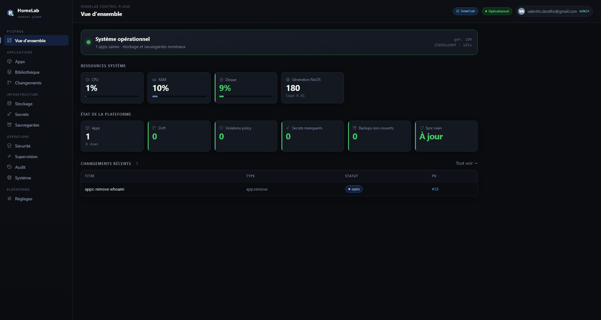
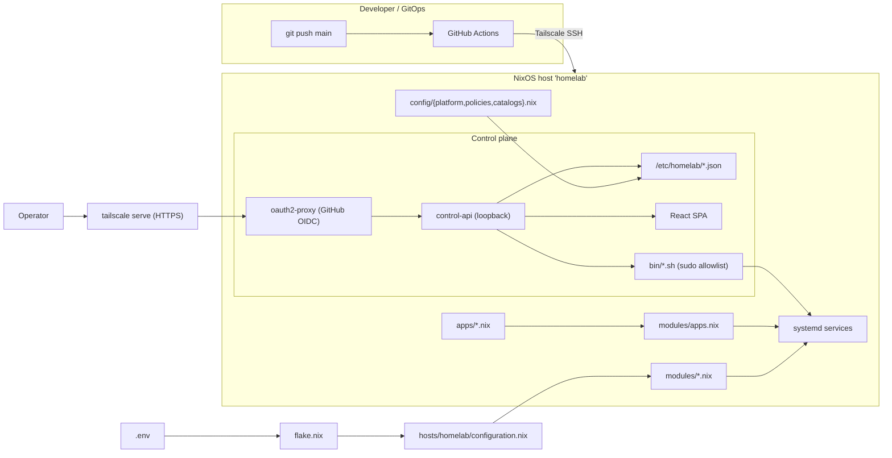

<p align="center">
  
</p>

<p align="center">
  <a href="https://nixos.org"></a>
  <a href="control-api/"></a>
  <a href="web/"></a>
  <a href="https://tailscale.com"></a>
  <a href="#project-status"></a>
  <a href="LICENSE"></a>
</p>

<h1 align="center">HomeLab</h1>

<p align="center">
  <b>Deploy and operate a single NixOS server entirely from Git — with a web UI and rollback safety.</b>
</p>

<p align="center">
  Declare your system, network and apps as code · ship changes through GitHub Actions over Tailscale ·
  operate the machine from a React control panel with guarded actions and automatic rollback.
</p>

---

## Table of contents

- [Screenshots](#screenshots)
- [Why this exists](#why-this-exists)
- [What it does](#what-it-does)
- [Highlights](#highlights)
- [Project status](#project-status)
- [Architecture](#architecture)
- [Prerequisites](#prerequisites)
- [Quick start](#quick-start)
- [Configuration](#configuration)
- [Usage](#usage)
- [Features](#features)
- [Security model](#security-model)
- [API](#api)
- [Project structure](#project-structure)
- [Operations scripts](#operations-scripts)
- [Tests](#tests)
- [Documentation](#documentation)
- [License](#license)

## Screenshots

<p align="center">
  
</p>

<p align="center"><sub>Control panel tour: overview · apps · library · GitOps changes · storage · secrets · backups · security · monitoring · audit · system · settings. UI shown in French.</sub></p>

<p align="center"><a href="docs/screenshots.md">📸 Full-size screenshots of every screen →</a></p>


## Why this exists

Running a personal server usually means hand-editing config over SSH, hoping a change
won't take the box down, and having no record of what was done. HomeLab turns that into a
**GitOps workflow**: the whole host — OS, networking, Docker, apps, secrets — is declared as
code, deployed through CI, and operated from a small web console that refuses to do anything
dangerous without a guard.

The result: a server you can rebuild from scratch, change safely (a failed deploy rolls
itself back), and operate without memorizing shell commands — while keeping the control plane
locked behind authentication on your private network.

## What it does

HomeLab is the single source of truth for one NixOS host (named `homelab`). The repository
declares the operating system, networking, Docker, the applications under `apps/`, secrets
(SOPS), and the deployment workflow. The host runs on a trusted network — primarily over
[Tailscale](https://tailscale.com/) — and changes pushed to `main` are validated and applied to
the host by GitHub Actions.

On top of the declarative base sits a small operational control plane:

- **`control-api`** — a dependency-free Go service that reports status and runs vetted host
  actions (systemd/Docker control, deployments, app lifecycle, backups, audit) behind a strict
  sudo allowlist and an **action policy engine** (rules deciding which actions are permitted).
- **A React web UI** — a single-page console served by `control-api` for day-to-day operation.
- **`oauth2-proxy` + `tailscale serve`** — the single entry point, exposed only on the tailnet;
  `control-api` itself binds to loopback and only ever receives authenticated traffic. The build
  refuses to start with an open auth front.

> Observability tools (Grafana, Prometheus, …) are **not** baked in. The platform lets *you*
> declare those as ordinary apps if you want them — they are not a built-in dependency.

## Highlights

- Reproducible NixOS host from a single flake
- GitHub Actions deployment over Tailscale, with an armed auto-rollback
- React control panel backed by a dependency-free Go API
- OAuth-protected access via oauth2-proxy, reachable only on the tailnet
- Declarative app definitions — drop a file, get a systemd service
- Audit log for every mutating action

## Project status

**Alpha · personal production.** HomeLab runs one author's real homelab host, but it is
single-host by design, evolving, and not hardened for multi-tenant or hostile-network use.
APIs and config shapes may change between versions. Treat it as a strong starting point you
adapt to your own host, not a turnkey appliance. See [Security model](#security-model) for the
explicit assumptions and non-goals, and [`docs/roadmap/`](docs/roadmap/) for open items.

## Architecture



See [`docs/architecture.md`](docs/architecture.md) for the full module breakdown and data flows.

## Prerequisites

HomeLab assumes you already have, or are comfortable setting up:

- a **NixOS** host (bare metal or VM) with [Nix flakes](https://nixos.wiki/wiki/Flakes) enabled
- a **[Tailscale](https://tailscale.com/)** tailnet and an auth key for the host
- a **GitHub** repository (your own fork) plus a **GitHub OAuth app** for oauth2-proxy
- **GitHub Actions** secrets configured for deploy over Tailscale
- [SOPS](https://github.com/getsops/sops) + [age](https://github.com/FiloSottile/age) for secrets

If you are new to any of these, start with [`docs/getting-started.md`](docs/getting-started.md).

## Quick start

```bash
# 1. Clone and create local config (point this at your own fork)
git clone https://github.com/Val-k7/HomeLab.git
cd HomeLab
cp .env.example .env
$EDITOR .env

# 2. Validate .env against the example (no unknown/missing keys)
bash bin/check-env.sh .env.example .env

# 3. Evaluate the flake with your .env (note: --impure, .env is read at eval)
HOMELAB_ENV="$PWD/.env" nix flake check --impure --no-build
```

First install from a NixOS ISO:

```bash
sudo nixos-generate-config --root /mnt
cp /mnt/etc/nixos/hardware-configuration.nix hosts/homelab/
sudo HOMELAB_ENV="$PWD/.env" nixos-install --flake .#homelab --impure
```

Apply on an existing NixOS host:

```bash
sudo HOMELAB_ENV="$PWD/.env" nixos-rebuild build  --flake .#homelab --impure
sudo HOMELAB_ENV="$PWD/.env" nixos-rebuild switch --flake .#homelab --impure
```

## Configuration

All host configuration originates from `.env`. The flake reads it via `HOMELAB_ENV` (falling
back to `$PWD/.env`), so Nix commands must pass `--impure`. Never write secrets into the README,
the guides or `.env.example` — keep operational secrets in SOPS, in GitHub Actions Secrets, or
in local git-ignored files.

Key variables (see [`docs/configuration.md`](docs/configuration.md) for the full table):

| Variable | Purpose | Example |
| --- | --- | --- |
| `HOSTNAME` | NixOS hostname | `homelab` |
| `USERNAME` | Primary admin user | `admin` |
| `USE_DHCP` / `STATIC_IP` / `GATEWAY` | Networking mode and static addressing | `true` / `192.168.1.50` / `192.168.1.1` |
| `SSH_AUTHORIZED_KEYS` | Public SSH keys (comma-separated) | `ssh-ed25519 AAAA... you@host` |
| `TAILSCALE_AUTHKEY_FILE` | Local file with the Tailscale auth key | `/etc/tailscale/authkey` |
| `CONTROL_API_PORT` | `control-api` port | `9092` |
| `OAUTH2_GITHUB_ORG` / `OAUTH2_GITHUB_USERS` | **Required** — restrict the auth front (org and/or user allowlist) | `my-org` / `alice,bob` |
| `REPO_URL` | Repo URL used by CI/CD and host fetches | `https://github.com/Val-k7/HomeLab` |

## Usage

Check the control-api (on the host):

```bash
curl -fsS http://127.0.0.1:9092/healthz
curl -fsS http://127.0.0.1:9092/v1/status
```

Inspect managed apps:

```bash
systemctl list-units 'app-*'
cat /etc/homelab/apps.json
```

Open the web UI through the tailnet (served by `control-api` behind `oauth2-proxy`):

```text
https://<host-on-tailnet>/
```

Mutating endpoints require a valid `X-HL-Token` issued by the UI; risky operations also need a
double confirmation.

## Features

- **Reproducible NixOS** via a single flake output: `nixosConfigurations.homelab`.
- **`.env`-driven host config** — host identity, networking, SSH, Tailscale and ports come from
  a single `.env` consumed at Nix evaluation time.
- **Composable modules** — `networking`, `ssh`, `docker`, `tailscale`, `apps`, `control-api`,
  `auth`, `backup`, `platform`, `secrets`.
- **Declarative apps** — drop an `apps/*.nix` file and `modules/apps.nix` turns it into a
  systemd service. Runners: `process`, `compose`, `dockerfile`, `image`, `nixos` (`image` and
  `nixos` are newer "v2" runner types — see [`docs/platform.md`](docs/platform.md)).
- **Platform manifests** — `config/{platform,policies,catalogs}.nix` are validated at build time
  and published read-only at `/etc/homelab/*.json` for `control-api` and the CI validator.
- **Operational control plane** — `control-api` (Go) + React SPA for status, actions,
  deployments, app lifecycle, storage, policy, backups and audit.
- **Authenticated by design** — `oauth2-proxy` (GitHub org/user allowlist) in front,
  `control-api` on loopback, exposed only over the tailnet via `tailscale serve`.
- **GitOps deploy with rollback guard** — push to `main` → GitHub Actions over Tailscale →
  `nixos-rebuild switch` with an armed auto-rollback if the post-switch health check fails.
- **Auditable** — every mutation is journaled to `/var/lib/homelab/*.jsonl`.
- **Dependency automation** — Renovate for Nix, Docker Compose and Git revisions in app modules.

| Layer | Technology |
| --- | --- |
| System | NixOS, Nix flakes, `nixpkgs` `nixos-25.11`, `sops-nix` |
| Config | Nix modules, `.env`, SOPS + age |
| Backend | Go 1.22, standard-library `net/http` (no external deps) |
| Web UI | React 18, Vite 5, TypeScript 5, `@tanstack/react-query` |
| Apps | systemd, Docker, Docker Compose |
| Access | Tailscale (`tailscale serve`), `oauth2-proxy` (GitHub OIDC), OpenSSH, fail2ban |
| CI/CD | GitHub Actions, Tailscale GitHub Action |
| Automation | Renovate |
| State | Local JSON/JSONL under `/var/lib/homelab` and `/etc/homelab` (no app database) |

## Security model

HomeLab is built around an explicit trust boundary. The full model — and its
forward-looking hardening items — is in [`docs/security.md`](docs/security.md). In short:

**What it guarantees**

- `control-api` binds to loopback only and never to a public interface.
- `oauth2-proxy` enforces a GitHub org/user allowlist; the build fails with an open front.
- The control plane is reachable only over the tailnet via `tailscale serve` (HTTPS).
- Mutations require a short-lived UI token; risky operations require double confirmation.
- A sudo allowlist + action policy engine bound what `control-api` may run; every mutation is
  audited to JSONL.

**Assumptions**

- The tailnet and the NixOS host itself are trusted; this is not a model for hostile LANs.
- The operator manages secrets correctly via SOPS/age and GitHub Actions Secrets.
- Single trusted host, single (or small) allowlisted operator set.

**Non-goals (current limitations)**

- Not multi-tenant; tokens are not yet role-separated (one token ≈ full operator power).
- No CSRF protection or rate limiting in front of the control plane yet.
- No per-endpoint auth for sensitive reads; SSH host-key verification still uses
  accept-new bootstrap. These are tracked in [`docs/roadmap/`](docs/roadmap/).

**Baseline checklist**

- Never commit `.env`, a private age key, a GitHub token, a Tailscale auth key, or an OAuth secret.
- Keep `SSH_PASSWORD_AUTH=false` and `SSH_OPEN_FIREWALL=false` unless you have an explicit need.
- Expose SSH and the control plane only over the tailnet / a trusted network.
- Store the Git token in SOPS / a host file read via `/run/secrets/git_token`.
- Review the audit trail via `/v1/audit` or `/var/lib/homelab/audit.jsonl`.

## API

`control-api` listens on `:9092` by default. It binds to loopback and only receives traffic from
`oauth2-proxy`. Mutations require an `X-HL-Token` (issued by the UI); risky operations require a
double confirmation.

A few key endpoints:

| Method | Endpoint | Description |
| --- | --- | --- |
| `GET` | `/healthz`, `/v1/status` | Liveness and NixOS generation / deploy state. |
| `GET` | `/v1/apps`, `/v1/apps/state` | App inventory and runtime state. |
| `POST` | `/v1/action` | Service/app control *(token + confirm)*. |
| `GET/POST` | `/v1/deployments` | Deployment history and `dry-run`/`build`/`switch`/`rollback`. |
| `GET` | `/v1/audit` | Audit trail of mutating actions. |

```bash
curl -fsS -X POST http://127.0.0.1:9092/v1/action \
  -H "Content-Type: application/json" \
  -H "X-HL-Token: <ui-token>" \
  -d '{"kind":"service","target":"app-whoami.service","op":"restart"}'
```

Full endpoint reference (apps lifecycle, staged changes, platform/policy/storage, backups,
secrets, health): [`docs/api.md`](docs/api.md).

## Project structure

```txt
homelab/
├── .github/workflows/        # deploy.yml, rollback.yml, checks.yml
├── apps/                     # declarative apps; *.nix at root are built
│   ├── whoami.nix
│   ├── whoami/docker-compose.yml
│   └── _templates/           # examples, not built
├── bin/                      # operational scripts (local / CI / control-api)
├── config/                   # platform.nix, policies.nix, catalogs.nix, access.json
├── control-api/              # Go control plane + tests
├── docs/                     # documentation (this set)
├── hosts/homelab/            # NixOS entry point + hardware config
├── lib/                      # .env loader + conversion helpers
├── modules/                  # NixOS modules
├── secrets/                  # SOPS-encrypted secrets
├── tests/                    # flake checks
├── web/                      # React + Vite SPA
├── .env.example
├── flake.nix
└── LICENSE
```

## Operations scripts

| Command | What it does |
| --- | --- |
| `bash bin/check-env.sh .env.example .env` | Diff `.env` against the example; flag unknown/missing keys. |
| `sudo bash bin/deploy.sh <repo> dry-run` | Sync the repo and run `nixos-rebuild dry-build`. |
| `sudo bash bin/deploy.sh <repo> build` | Sync and build the configuration. |
| `sudo bash bin/deploy.sh <repo> switch` | Sync, build, switch, and arm an auto-rollback if health fails. |
| `sudo bash bin/deploy.sh <repo> rollback` | Roll back to the previous NixOS generation. |
| `sudo bash bin/apply.sh <app> <repo>` | Bump an app's `rev` to its upstream `HEAD`, commit, push, deploy. |
| `sudo bash bin/app-create.sh <app> <proposal> <repo> <mode>` | Create an app from an API-generated proposal. |
| `sudo bash bin/app-rollback.sh <app> <rev> <repo>` | Pin an app back to a given revision, then deploy. |
| `sudo bash bin/backup.sh` | Run the backup routine (see `modules/backup.nix`). |
| `cd control-api && go test ./...` | Run the Go test suite. |
| `nix flake check --impure --no-build` | Evaluate the flake against your `.env`. |

See [`docs/scripts.md`](docs/scripts.md) for full details.

## Tests

```bash
cd control-api && go test ./...                       # Go suite
bash bin/check-env.sh .env.example .env               # config sanity
HOMELAB_ENV="$PWD/.env" nix flake check --impure --no-build   # Nix eval
```

## Documentation

Start at [`docs/index.md`](docs/index.md). Highlights:

| Guide | Topic |
| --- | --- |
| [Getting started](docs/getting-started.md) | Local setup, first run. |
| [Architecture](docs/architecture.md) | Modules, flows, control plane. |
| [Configuration](docs/configuration.md) | `.env`, config files, secrets. |
| [API](docs/api.md) | Endpoints, auth, request/response. |
| [Deployment](docs/deployment.md) | GitHub Actions, rollback. |
| [Platform](docs/platform.md) | Platform manifests and app lifecycle. |
| [Scripts](docs/scripts.md) | Operational scripts under `bin/`. |
| [Backups](docs/backups.md) | Backup/restore strategy. |
| [Persistence](docs/persistence.md) | Per-app persistent data and what to back up. |
| [Security](docs/security.md) | Trust boundary, assumptions, hardening. |
| [Troubleshooting](docs/troubleshooting.md) | Common issues. |
| [Runbook](docs/runbook.md) | Emergency procedures and break-glass access. |
| [Contributing](docs/contributing.md) | Git workflow, conventions, code standards. |

See the [Changelog](docs/changelog/v0.1.md) for release notes.

## License

MIT — see [LICENSE](LICENSE).
