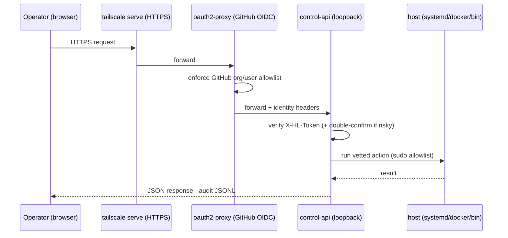

# API

The project exposes an HTTP API through `control-api`. It is used to operate the homelab and to serve the management UI (a React single-page app).

> **Type:** reference · **Audience:** operator / integrator · **Last reviewed:** 2026-06-11

## Overview

- Binary: `control-api`
- Language: Go 1.22
- NixOS port: `CONTROL_API_PORT`, defaults to `9092`
- Direct address: `CONTROL_API_ADDR`, defaults to `127.0.0.1:9092`
- Local state: `HOMELAB_STATE_DIR`, defaults to `/var/lib/homelab`
- Repository directory on the host: `HOMELAB_DIR`, defaults to `/home/admin/homelab`

## Access and authentication

`control-api` binds to loopback (`127.0.0.1:9092`) and is never exposed directly. All traffic reaches it through `oauth2-proxy`, which authenticates the caller against GitHub (OIDC) and enforces a GitHub org/user allowlist. `oauth2-proxy` is in turn published over the tailnet via `tailscale serve` HTTPS. The API therefore only ever receives requests that have already been authenticated by the proxy, and it reads the caller identity from the proxy-supplied headers.

`GET` endpoints do not require an application token: they rely on the proxy and the role attached to the authenticated identity.

Mutation endpoints (`POST`) additionally require a header:

```http
X-HL-Token: <token-ui>
```

This token is issued by the UI and expires after a short period. Risky operations first return a `409 Conflict` response with a `confirm_id`; the client must echo that `confirm_id` in a second request to confirm.

Example confirmation response:

```json
{
  "ok": false,
  "confirm": "double",
  "confirm_id": "abc123",
  "expires_in": 10,
  "message": "Confirm deploy switch"
}
```

## Endpoints

### Core and system

| Method | Endpoint | Description | Auth |
| --- | --- | --- | --- |
| `GET` | `/healthz` | Plain-text `ok` health check. | No |
| `GET` | `/metrics` | Plain-text metrics for `control-api` (`hl_control_api_up`, `hl_current_generation`). | No |
| `GET` | `/` | React SPA (control UI); also serves the bundle assets. | No |
| `GET` | `/v1/status` | Current NixOS generation and deployment state. | No |
| `GET` | `/v1/system` | Host system metrics. | No |
| `GET` | `/v1/me` | Identity of the authenticated caller (from proxy headers). | No |
| `GET` | `/v1/logs` | systemd journal logs for a unit. | operator role |
| `GET` | `/v1/targets` | Service, infra, and container targets plus allowed actions. | No |
| `POST` | `/v1/action` | Runs `start`, `stop`, or `restart` on an allowed target. | UI token; confirmation by risk |
| `POST` | `/v1/reboot` | Reboots the host. | UI token + double confirmation |
| `GET` | `/v1/audit` | Reads recent audit events. | No |
| `POST` | `/v1/audit/prune` | Prunes the audit log. | admin role |
| `GET` | `/v1/logs/infra` | Journal logs for infra units. | operator role |
| `GET` | `/v1/observability` | Detailed observability state: host roll-up, per-app and infra metrics. | No |

### Deployments and updates

| Method | Endpoint | Description | Auth |
| --- | --- | --- | --- |
| `POST` | `/v1/deploy` | Triggers a `switch` deployment. | UI token + double confirmation |
| `GET` | `/v1/deployments` | Deployment history, systemd jobs, and optional logs. | No |
| `POST` | `/v1/deployments` | Runs `dry-run`, `build`, `switch`, or `rollback`. | UI token; confirmation for `switch` and `rollback` |
| `GET` | `/v1/update-check` | Compares the deployed commit with the remote `main` branch. | No |
| `GET` | `/v1/drift` | Drift between the deployed state and the repository. | operator role |
| `GET` | `/v1/updates` | Lists apps whose `rev` differs from upstream `HEAD`. | No |
| `POST` | `/v1/apply` | Applies the latest upstream revision of an app. | UI token + double confirmation |

### Apps and catalog

| Method | Endpoint | Description | Auth |
| --- | --- | --- | --- |
| `GET` | `/v1/catalog` | Lists the app catalog. | No |
| `GET` | `/v1/apps` | Lists declared apps. | No |
| `POST` | `/v1/apps/propose` | Generates an app Nix module without committing it. | UI token |
| `POST` | `/v1/apps/create` | Creates an app via `bin/app-create.sh`. | UI token; confirmation if `deploy_mode=switch` |
| `GET` | `/v1/apps/state` | Enriched per-app view: desired, runtime, drift, storage, secrets, backup, policy. | viewer role |

## `GET /v1/status`

Returns the NixOS generation and the state of deployment jobs.

```bash
curl -fsS http://127.0.0.1:9092/v1/status
```

```json
{
  "generation": 42,
  "deploy": "idle"
}
```

## `GET /v1/targets`

Returns the targets the API can drive.

Main fields:

| Field | Description |
| --- | --- |
| `services` | systemd `app-*.service` units. |
| `infra` | Infra services allowed by policy, notably `docker.service` and `control-api.service`. |
| `containers` | Docker containers, excluding ignored infra containers. |
| `generation` | Current NixOS generation. |
| `deploy` | Deployment state. |

Each action carries a `risk` value of `safe`, `risky`, or `blocked`.

## `POST /v1/action`

Runs an action on an allowed service or container.

Request body:

```json
{
  "kind": "service",
  "target": "app-whoami.service",
  "op": "restart",
  "confirm_id": ""
}
```

Supported values:

| Field | Values |
| --- | --- |
| `kind` | `service`, `container` |
| `op` | `start`, `stop`, `restart` |

Rules:

- The critical services `sshd`, `tailscaled`, `systemd-networkd`, `network-*`, `nftables`, and `firewall` are blocked.
- `control-api.service` is blocked from a direct restart.
- `app-*.service` units accept `start` and `restart` as `safe`; `stop` is `risky`.
- `docker.service` accepts `restart` only, as `risky`.
- Docker containers accept `start`, `restart`, and `stop`; `stop` is `risky`.

OK response:

```json
{
  "ok": true,
  "kind": "service",
  "target": "app-whoami.service",
  "op": "restart",
  "state": "active",
  "healthy": true,
  "output": ""
}
```

## Authenticated mutation flow

The diagram below shows how an authenticated mutation (for example `POST /v1/deploy`) travels from the operator's browser to the host.



## `POST /v1/deployments`

Starts a deployment job.

Request body:

```json
{
  "mode": "build",
  "target": "",
  "confirm_id": ""
}
```

Modes:

| Mode | Description | Confirmation |
| --- | --- | --- |
| `dry-run` | Runs `nixos-rebuild dry-build`. | No |
| `build` | Runs `nixos-rebuild build`. | No |
| `switch` | Applies the configuration. | Yes |
| `rollback` | Reverts to a target generation or revision. | Yes |

Example `target` values:

| Target | Use |
| --- | --- |
| empty | Standard deployment. |
| `42` | System rollback to a generation. |
| `app:whoami:<rev>` | Rollback of an app to a revision. |

Response:

```json
{
  "ok": true,
  "job_id": "20260607-100000-abcdef",
  "unit": "hl-deploy-20260607-100000-abcdef",
  "output": "deployment started"
}
```

## `GET /v1/deployments`

Parameters:

| Parameter | Description |
| --- | --- |
| `limit` | Maximum number of history entries; internal cap of 200. |
| `unit` | systemd unit whose `journalctl` logs should be returned. |

Response:

```json
{
  "history": [],
  "jobs": [],
  "generation": 42,
  "deploy": "idle"
}
```

## `POST /v1/apps/propose`

Validates an app definition and returns the proposed Nix file without writing it to the repository.

Body for a `process` app:

```json
{
  "name": "demo",
  "runner": "process",
  "repo": "https://example.test/demo.git",
  "rev": "abcdef",
  "runtime": "nodejs_22",
  "build_cmd": "npm ci && npm run build",
  "start_cmd": "node dist/index.js",
  "port": 3001,
  "packages": [],
  "env_file": "",
  "deploy_mode": "none"
}
```

Accepted runners:

| Runner | Required fields |
| --- | --- |
| `process` | `repo`, `rev`, `runtime`, `build_cmd`, `start_cmd` |
| `dockerfile` | `repo`, `rev` |
| `compose` | `dir` |

Response:

```json
{
  "ok": true,
  "path": "apps/demo.nix",
  "content": "{\n  runner = \"process\";\n}\n"
}
```

## `POST /v1/apps/create`

Creates an app in the repository via `bin/app-create.sh`.

`deploy_mode` accepts:

| Mode | Effect |
| --- | --- |
| `none` | Commit on an `app-create/...` branch. |
| `dry-run` | `app-create/...` branch, then dry-run. |
| `build` | `app-create/...` branch, then build. |
| `switch` | Push to `main`; CI deploys. |

Response:

```json
{
  "ok": true,
  "job_id": "20260607-100000-abcdef",
  "unit": "hl-app-create-20260607-100000-abcdef",
  "path": "apps/demo.nix"
}
```

## `POST /v1/apply`

Updates an existing app to the upstream `HEAD` revision.

Body:

```json
{
  "app": "demo",
  "confirm_id": ""
}
```

Response:

```json
{
  "ok": true,
  "output": "apply started",
  "unit": "hl-apply"
}
```

## `GET /v1/audit`

Reads audit events from `/var/lib/homelab/audit.jsonl`.

Parameter:

| Parameter | Description |
| --- | --- |
| `limit` | Maximum number of events; internal cap of 500. |

```bash
curl -fsS 'http://127.0.0.1:9092/v1/audit?limit=20'
```

## Platform V2 — read-only endpoints

| Endpoint | Min role | Description |
| --- | --- | --- |
| `GET /v1/platform` | viewer | Platform configuration (`/etc/homelab/platform.json`). |
| `GET /v1/policies` | viewer | Policies, live violations, and `has_errors`. |
| `GET /v1/storage` | viewer | Declared (desired) storage classes and volumes. |
| `GET /v1/library` | viewer | Enabled catalogs and installed modules (`workshop-lock.json`). |
| `GET /v1/library/catalog/` | viewer | Catalog detail for the library. |
| `GET /v1/secrets/status` | viewer | Per-secret status: `present` / `missing` / `optional_missing`. Never a value. |
| `GET /v1/apps/state` | viewer | Enriched per-app view: desired, runtime, drift, storage, secrets, backup, policy. |
| `GET /v1/health/apps` | viewer | Live health check for each v2 app. |
| `GET /v1/backups` | viewer | Backup coverage per app plus last backup/restore. |
| `GET /v1/changes` | viewer | Pending change set. |
| `GET /v1/changes/diff` | operator | Diff of a pending change. |
| `GET /v1/configfile` | operator | Reads a managed configuration file. |
| `GET /v1/storage/orphans` | operator | Lists orphaned storage data (declared volumes vs on-disk). |
| `GET /v1/backups/logs` | operator | Journal logs of the backup units. |

## Platform V2 — changes (PR)

These endpoints stage changes as pull requests; they do not switch the system directly.

| Endpoint | Min role | Effect |
| --- | --- | --- |
| `POST /v1/changes/refresh` | operator | Refreshes the pending change set. |
| `POST /v1/changes/app-add/preview` | operator | Previews adding an app. |
| `POST /v1/changes/app-add` | operator | Adds an app to the change set. |
| `POST /v1/changes/app-update` | operator | Bumps an app revision. |
| `POST /v1/changes/app-rollback` | operator | Rolls an app back to a revision. |
| `POST /v1/changes/app-install` | operator | Installs a workshop module: v2 `apps/<app>.nix` + a `workshop-lock.json` entry (exact SHA required). |
| `POST /v1/changes/app-secret` | operator | Generates a SOPS-encrypted file `secrets/apps/<app>.yaml`. No cleartext value. |
| `POST /v1/changes/app-policy` | operator | Changes an app's `updatePolicy` or `criticality`. |
| `POST /v1/changes/app-storage` | operator | Changes an app's storage declaration. |
| `POST /v1/changes/storage-class` | operator | Changes a storage class. |
| `POST /v1/changes/platform-config` | operator | Changes the platform configuration. |
| `POST /v1/changes/policy-config` | operator | Changes the policy configuration. |
| `POST /v1/changes/app-remove` | operator | Removes an app. |
| `POST /v1/changes/storage-class-remove` | admin | Removes a storage class. |
| `POST /v1/changes/catalog-add` | operator | Adds a catalog. |
| `POST /v1/changes/catalog-update` | admin | Updates a catalog entry. |
| `POST /v1/changes/catalog-remove` | admin | Removes a catalog entry. |
| `POST /v1/changes/access-role` | operator | Changes an access role. |
| `POST /v1/changes/system-secret` | admin | Generates a SOPS-encrypted system secret `secrets/system/<key>.yaml`. No cleartext value. |
| `POST /v1/changes/retry` | operator | Retries a failed change. |
| `POST /v1/changes/merge` | maintainer | Merges a change's pull request. |
| `POST /v1/changes/close` | operator | Closes a change without merging. |
| `POST /v1/changes/prune` | admin | Prunes old change records. |

## Platform V2 — runtime actions (audited)

| Endpoint | Min role | Effect |
| --- | --- | --- |
| `POST /v1/health/check` | operator | Runs an app's health check immediately. |
| `POST /v1/library/refresh` | operator | Refreshes the workshop catalogs. |
| `POST /v1/apps/purge-data` | admin | Purges an app's on-disk data. |
| `POST /v1/backups/run` | maintainer | Starts a restic backup now. |
| `POST /v1/backups/restore-test` | maintainer | Tests the integrity of the restic repository. |
| `POST /v1/backups/verify` | maintainer | Verifies a sample of the data. |
| `POST /v1/backups/snapshots` | maintainer | Lists snapshots. |
| `POST /v1/backups/restore` | maintainer | Restores to a temporary path. |

All runtime actions write an audit event and never touch Git.

## Error codes

| Code | Detected case |
| --- | --- |
| `400` | Invalid JSON, invalid parameter, or unsupported mode. |
| `403` | UI token missing/expired, or action blocked by policy/role. |
| `409` | Double confirmation required. |
| `500` | System command error, state write failure, or script execution error. |
| `502` | Post-action health check not healthy. |

## TODO / open items

- External authentication contract if the API is to be consumed outside the UI.
- Formal JSON schema for each endpoint.
- Retention policy for `/var/lib/homelab/audit.jsonl` and `deployments.jsonl`.
