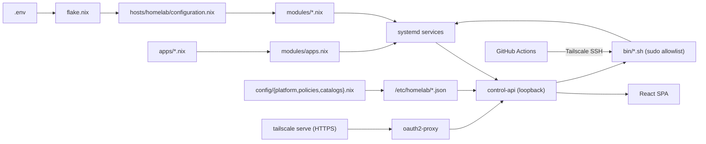

# Architecture

This document describes how the HomeLab repository is organized and the main flows that run on
the host.

> **Type:** explanation · **Audience:** operator / contributor · **Last reviewed:** 2026-06-11

## Overview

HomeLab is built around a single NixOS configuration:

```text
flake.nix -> hosts/homelab/configuration.nix -> modules/*.nix
```

The configuration is parameterized by `.env`. Applications are declared in `apps/*.nix`, turned
into systemd services by `modules/apps.nix`, and operated through the control plane.



## Directory layout

| Directory | Responsibility |
| --- | --- |
| `.github/workflows/` | Deploy, rollback and CI check workflows. |
| `apps/` | Application definitions and runner examples. |
| `bin/` | Operational scripts run locally, by CI, or by `control-api`. |
| `config/` | Platform V2 inputs: `platform.nix`, `policies.nix`, `catalogs.nix`, `access.json`. |
| `control-api/` | Go control plane, policy engine, state, tests, and the platform validator. |
| `docs/` | Technical documentation. |
| `hosts/homelab/` | NixOS entry point and hardware configuration. |
| `lib/` | Nix helpers that load and convert `.env`. |
| `modules/` | Functional NixOS modules. |
| `secrets/` | SOPS-encrypted secrets. |
| `tests/` | Flake checks. |
| `web/` | React + Vite single-page UI. |

## Module responsibilities

| Module | Role |
| --- | --- |
| `modules/networking.nix` | Hostname, IPv4 DHCP/static, DNS, IPv6, base firewall. |
| `modules/ssh.nix` | OpenSSH, hardening options, fail2ban. |
| `modules/docker.nix` | Docker, Docker Compose, log rotation/prune. |
| `modules/tailscale.nix` | Tailscale, Tailscale SSH, tailnet ports, IP forwarding. |
| `modules/apps.nix` | Generates systemd services from `apps/*.nix`; publishes `/etc/homelab/apps.json`. |
| `modules/platform.nix` | Validates `config/{platform,policies,catalogs}.nix` and publishes `/etc/homelab/*.json`. |
| `modules/control-api.nix` | Builds the Go binary, the systemd service, environment, sudo allowlist and loopback bind. |
| `modules/auth.nix` | `oauth2-proxy` (GitHub OIDC) front and `tailscale serve` exposure. |
| `modules/backup.nix` | Backup routine and scheduling. |
| `modules/secrets.nix` | `sops-nix` integration and the `git_token` secret. |
| `modules/alerting.nix` | Failure alerting via webhook (ntfy/Slack/Discord/generic). |
| `modules/observability.nix` | Opt-in `node_exporter` + Prometheus; off by default. |

> There is intentionally **no built-in** dashboarding. Host metrics that the UI
> needs are served directly by `control-api` (`control-api/system.go`). The optional
> observability module (off by default) provides `node_exporter` and Prometheus;
> Grafana remains an ordinary declared app under `apps/`.

## Control plane

`control-api` is a Go service with no external module dependencies (`net/http`). It shells out to
`systemctl`, `docker`, `systemd-run`, `journalctl` and the `bin/` scripts.

Key files:

| File | Role |
| --- | --- |
| `control-api/main.go` | Route table, host actions, healthcheck, SPA serving. |
| `control-api/spa.go` | Serves the built React bundle (`WEB_ROOT`). |
| `control-api/apps_api.go` / `apps_state.go` | App validation, proposal, creation, runtime state. |
| `control-api/change_*.go` | Staged GitOps changes (`/v1/changes/*`). |
| `control-api/deployments.go` | Deployments, rollback, systemd jobs, history. |
| `control-api/policy.go` / `policy_engine.go` | Action allowlist and risk levels. |
| `control-api/platform.go` | Reads the platform manifests. |
| `control-api/backups.go` | Backup lifecycle endpoints. |
| `control-api/authz.go` / `state.go` | Auth (oauth2-proxy identity, CSRF), UI tokens, confirmations, audit. |
| `control-api/cmd/validate-platform/` | CI validator for the platform manifests. |

Mutations are protected by:

- a short-lived UI token (`X-HL-Token`);
- a double confirmation for risky operations;
- an action allowlist + policy engine;
- JSONL audit events under `/var/lib/homelab/`.

### Trust boundary

`control-api` binds to loopback. `oauth2-proxy` (GitHub org/user allowlist — required, the build
fails if it is left open) is the only thing that injects identity headers, and `tailscale serve`
publishes it over HTTPS on the tailnet. Nothing is served on a raw public IP, and client-supplied
identity headers cannot reach `control-api`.

## Application runners

Files in `apps/*.nix` are imported automatically (except `default.nix` and `_templates/`).

| Runner | Main fields | Behavior |
| --- | --- | --- |
| `process` | `repo`, `rev`, `runtime`, `buildCmd`, `startCmd`, `port`, `packages`, `env`, `envFile` | Clones the repo to `/var/lib/app-<name>/src`, checks out `rev`, rebuilds when the revision changes, runs a systemd process with `DynamicUser`. |
| `compose` | `dir`, `port`, `envFile` | Runs `docker compose -f <dir>/docker-compose.yml up -d` via systemd. |
| `dockerfile` | `repo`, `rev`, `port`, `envFile` | Clones the repo, builds a revision-tagged image, runs `docker run`. |
| `image` | `image`, `tag`/`digest`, `port` | Runs a pinned upstream image (V2 unit). |

`modules/apps.nix` generates `/etc/homelab/apps.json`, consumed by `control-api`.

## Main flows

### Nix evaluation

1. `flake.nix` reads `HOMELAB_ENV` (or `$PWD/.env`).
2. `lib/load-env.nix` parses `KEY=value` lines.
3. `lib/env-lib.nix` provides `get`, `getBool`, `getInt`, `getList`.
4. The NixOS modules use those values to produce the system configuration.

### GitHub Actions deployment

1. `.github/workflows/deploy.yml` detects changed files (pure-Markdown changes skip the host deploy).
2. The `check` job runs `nix flake check --impure --no-build` when infra files change.
3. The runner joins Tailscale.
4. The workflow writes `.env` on the host.
5. The remote checkout is synced to the GitHub SHA.
6. `systemd-run` launches `bin/deploy.sh` as a detached unit.
7. The workflow waits, then verifies `/healthz` and `/v1/deployments`.

### NixOS switch with rollback guard

`bin/deploy.sh` in `switch` mode:

1. syncs the repo;
2. runs `bin/check-env.sh`;
3. builds the configuration;
4. arms an automatic rollback unit;
5. applies `nixos-rebuild switch`;
6. verifies a default route and `sshd`;
7. disarms the rollback if health is good;
8. records the deployment in `/var/lib/homelab/deployments.jsonl`.

### Application lifecycle

1. `POST /v1/apps/propose` validates a request and returns the proposed Nix content.
2. `POST /v1/apps/create` writes the proposal into local state and runs `bin/app-create.sh`.
3. The script commits on a change branch, or pushes to `main` in `switch` mode.
4. `bin/apply.sh` bumps an app's `rev` to upstream `HEAD`; `bin/app-rollback.sh` pins it back to a
   target revision — both commit, push to `main`, then deploy.

## Important internal dependencies

- `modules/control-api.nix` builds the binary from `control-api/`.
- `control-api` depends on `bin/deploy.sh`, `bin/app-create.sh`, `bin/apply.sh`, `bin/app-rollback.sh`.
- `modules/apps.nix` exposes `/etc/homelab/apps.json`; `modules/platform.nix` exposes the platform manifests.
- `bin/deploy.sh` and the app scripts use `/run/secrets/git_token` for private Git over HTTPS.

## Going deeper

This page explains the design. For implementation-level detail generated from the codebase
knowledge graph, see the deep-dive reference series:

- [Architectural layers](reference-layers.md) — the 8 layers and how they connect.
- [Dependency map](reference-dependency-map.md) — fan-in hotspots, configuration flow, test coverage.
- Control API: [handlers](reference-control-api-handlers.md) ·
  [change gateway & policy engine](reference-control-api-changes.md) ·
  [system & operations](reference-control-api-system.md).
- Nix: [modules](reference-nix-modules.md) · [library & config](reference-nix-lib.md) ·
  [hosts, flake & tests](reference-nix-hosts.md).
- Web UI: [shell & API layer](reference-web-api-layer.md) · [screens](reference-web-screens.md).
- Tooling: [CI/CD pipelines](reference-ci-pipelines.md) ·
  [script internals](reference-bin-internals.md) · [test suite](reference-tests.md).

## TODO / open items

- A real network diagram with IPs, tailnet name and LAN segmentation.
- Persistence strategy for app data outside `/var/lib/homelab`.
- Governance conventions if multiple maintainers operate the host.
