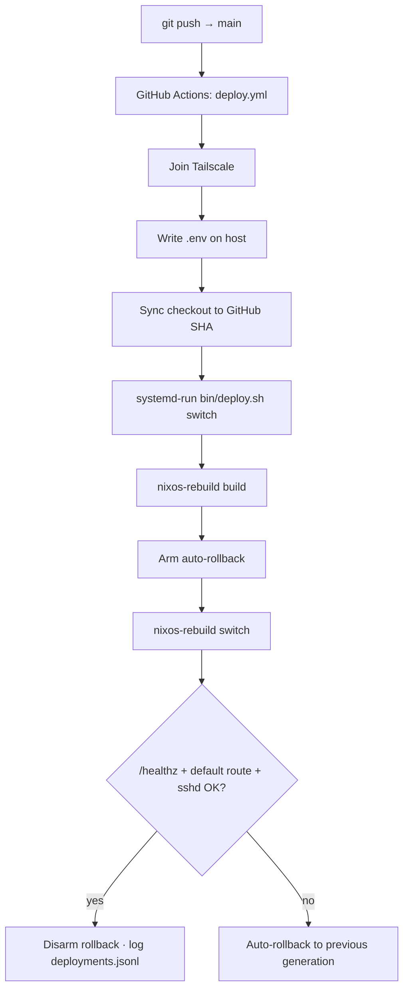

# Deployment

This guide describes the build, deployment, and rollback modes available in the repository.

> **Type:** how-to · **Audience:** operator · **Last reviewed:** 2026-06-11

## Overview

There are two deployment paths:

1. Local deployment from the host using `nixos-rebuild` or `bin/deploy.sh`.
2. Automated deployment through `.github/workflows/deploy.yml`, Tailscale, and SSH.

The NixOS target is:

```text
.#homelab
```

## Production build

Local build:

```bash
sudo HOMELAB_ENV="$PWD/.env" nixos-rebuild build --flake .#homelab --impure
```

Local switch:

```bash
sudo HOMELAB_ENV="$PWD/.env" nixos-rebuild switch --flake .#homelab --impure
```

Via the operations script:

```bash
sudo bash bin/deploy.sh /home/admin/homelab build
sudo bash bin/deploy.sh /home/admin/homelab switch
```

## `bin/deploy.sh` modes

| Mode | Description |
| --- | --- |
| `dry-run` | Syncs the repository, validates `.env`, then runs `nixos-rebuild dry-build`. |
| `build` | Syncs the repository, validates `.env`, then runs `nixos-rebuild build`. |
| `switch` | Builds, then applies the configuration with the rollback guard. |
| `rollback` | Reverts to the previous generation or to a target generation. |

Examples:

```bash
sudo bash bin/deploy.sh /home/admin/homelab dry-run
sudo bash bin/deploy.sh /home/admin/homelab build
sudo bash bin/deploy.sh /home/admin/homelab switch
sudo bash bin/deploy.sh /home/admin/homelab rollback
sudo bash bin/deploy.sh /home/admin/homelab rollback 42
```

## Rollback guard

In `switch` mode, `bin/deploy.sh`:

1. stops any existing `hl-rollback.timer` unit;
2. arms an automatic rollback to fire after 180 seconds;
3. applies `nixos-rebuild switch`;
4. waits 8 seconds;
5. verifies that a default route exists and that `sshd` is active;
6. disarms the rollback if the check succeeds;
7. records the result in `/var/lib/homelab/deployments.jsonl`.

If the check fails, the script lets the automatic rollback run.

## Required variables

### On the host

| Variable | Description |
| --- | --- |
| `HOMELAB_ENV` | Path to the `.env` file used by Nix. |
| `HOMELAB_DEPLOY_REF` | Git reference to deploy; defaults to `origin/main`. |
| `HOMELAB_FLAKE_REF` | Flake reference; defaults to `path:<dir>#homelab`. |
| `HOMELAB_REPO_USER` | User that owns the checkout. |
| `HOMELAB_REPO_URL` | Preferred Git URL. |
| `HOMELAB_GIT_TOKEN_FILE` | File containing the Git token; defaults to `/run/secrets/git_token`. |
| `REPO_URL` | Repository URL read from `.env` when `HOMELAB_REPO_URL` is not set. |

### In GitHub Actions

The workflow uses the following secrets:

```text
SSH_USER
SSH_HOST
SSH_KNOWN_HOSTS
TS_OAUTH_CLIENT_ID
TS_OAUTH_SECRET
HOSTNAME
TIMEZONE
LOCALE
USERNAME
USER_DESCRIPTION
SUDO_NEEDS_PASSWORD
INTERFACE
USE_DHCP
STATIC_IP
PREFIX_LENGTH
GATEWAY
NAMESERVERS
ENABLE_IPV6
SSH_PORT
SSH_OPEN_FIREWALL
SSH_PASSWORD_AUTH
SSH_AUTHORIZED_KEYS_FILE
SSH_AUTHORIZED_KEYS
TAILSCALE_AUTHKEY_FILE
CONTROL_API_PORT
REPO_URL
OAUTH2_GITHUB_ORG
OAUTH2_GITHUB_USERS
```

Never print the actual values in logs or documentation.

## GitHub Actions workflow

The `.github/workflows/deploy.yml` workflow runs:

- on push to `main`;
- manually via `workflow_dispatch`.

Main steps:

1. Check out the repository and detect changed files.
2. Run the Nix evaluation gate (`check`) when infrastructure files change.
3. Connect the runner to the tailnet with `tailscale/github-action@v3`.
4. Write `.env` on the host.
5. Sync the host checkout to the GitHub SHA (`git reset --hard <sha>`).
6. Dispatch `bin/deploy.sh ... switch` via `systemd-run` as the `ci-deploy` unit.
7. Wait for the `ci-deploy` unit to finish.
8. Verify the deployed commit, then check `/healthz` and `/v1/deployments`.

In `switch` mode, the host arms an automatic rollback that fires if the post-switch health check fails. Markdown-only changes do not trigger a host deployment.

### Deploy pipeline



## GitHub Actions rollback

The `.github/workflows/rollback.yml` workflow is manual.

Without a target generation:

```text
sudo nixos-rebuild switch --rollback
```

With a target generation:

```text
sudo nix-env --profile /nix/var/nix/profiles/system --switch-generation <generation>
sudo /nix/var/nix/profiles/system/bin/switch-to-configuration switch
```

A separate workflow, `.github/workflows/checks.yml`, gates the repository with the following jobs:

- `go` — `go vet`, `go test`, `staticcheck`, `gofmt`;
- `secrets-scan` — gitleaks;
- `actionlint` — workflow linting;
- `web` — web UI build;
- `shellcheck` — shell script linting;
- `discover` + `platform` — per-host `nix flake check --impure` plus strict `validate-platform`;
- `restore-e2e` — NixOS VM backup→restore test; it also gates releases via `release.yml`.

## Deployments through the API

`control-api` exposes:

- `POST /v1/deploy` for a `switch`;
- `POST /v1/deployments` for `dry-run`, `build`, `switch`, and `rollback`;
- `GET /v1/deployments` for history and jobs;
- `POST /v1/apply` to update an app;
- `POST /v1/apps/create` to create an app.

Mutations require an `X-HL-Token` header. `switch`, `rollback`, reboot, and other risky operations require a double confirmation. The API binds to loopback (`127.0.0.1:9092`) and only receives traffic forwarded by oauth2-proxy (GitHub OIDC), which is itself exposed over the tailnet via `tailscale serve` HTTPS.

## Detected supported platforms

| Component | Detected platform |
| --- | --- |
| NixOS | `x86_64-linux` in `flake.nix` |
| CI | `ubuntu-latest` in GitHub Actions |
| CI → host network | Tailscale |
| Apps | systemd, Docker, Docker Compose |

## Post-deployment checks

On the host:

```bash
cat /var/lib/homelab/deployed-commit
systemctl status control-api
systemctl status docker
systemctl list-units 'app-*'
curl -fsS http://127.0.0.1:9092/healthz
curl -fsS http://127.0.0.1:9092/v1/deployments
```

Useful logs:

```bash
journalctl -u ci-deploy -n 120 --no-pager
journalctl -u control-api -n 100 --no-pager
journalctl -u app-whoami -n 100 --no-pager
```

## TODO / open items

- Official SLA or maintenance window.
- Backup procedure to run before deployment.
- Application-level rollback strategy for apps that manage persistent data.
