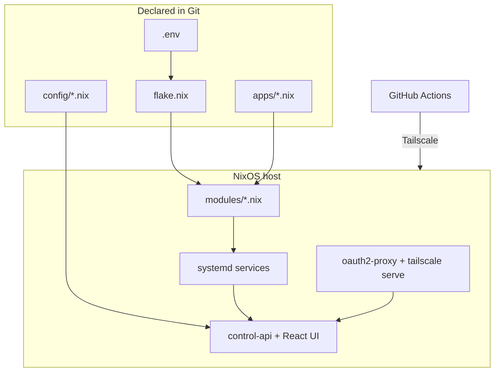

  

# HomeLab Documentation

Technical documentation for the HomeLab repository — a reproducible, single-host NixOS homelab
operated through Git, a Go control plane, and a React web UI.

> New here? Start with **[Getting started](getting-started.md)**, then skim
> **[Architecture](architecture.md)** for the big picture.

Pages are organized by the [Diátaxis](https://diataxis.fr) framework — pick the column that
matches what you need right now. Writing docs? See the **[style guide](STYLE.md)**.

## 🎓 Tutorials — learn by doing

| Guide | Description |
| --- | --- |
| [Getting started](getting-started.md) | Local setup, first build, first run. |
| [Installation](installation.md) | Full installation walkthrough on a fresh host. |

## 🛠️ How-to guides — get a task done

| Guide | Description |
| --- | --- |
| [Deployment](deployment.md) | GitHub Actions pipeline, build modes, rollback (flow diagram). |
| [Operations](operations.md) | Day-2 operational notes. |
| [Backups](backups.md) | Backup/restore strategy and dead-machine recovery. |
| [Troubleshooting](troubleshooting.md) | Common issues, causes, and useful commands. |
| [Runbook](runbook.md) | Emergency procedures: outages, break-glass access, recovery. |
| [Contributing](contributing.md) | Git workflow, conventions, and code standards. |

## 📖 Reference — look it up

| Document | Description |
| --- | --- |
| [Configuration](configuration.md) | `.env` variables, config files, secrets. |
| [API](api.md) | `control-api` endpoints, auth, request/response (sequence diagram). |
| [Scripts](scripts.md) | Operational scripts under `bin/`. |
| [Versioning](versioning.md) | Semver policy, the frozen `/v1` contract, road to 1.0. |
| [Git token permissions](git-token-permissions.md) | Required GitHub token scopes. |
| [Screenshots](screenshots.md) | UI screenshot index. |
| [Changelog](changelog/) | Release notes (`v0.1`). |

### Deep-dive reference

Implementation-level reference generated from the codebase knowledge graph — one page per
subsystem, complementing the contract-level pages above.

| Document | Description |
| --- | --- |
| [Architectural layers](reference-layers.md) | The 8 layers of the codebase and how they connect. |
| [Dependency map](reference-dependency-map.md) | Cross-component dependencies, fan-in hotspots, test coverage. |
| [Control API: handlers](reference-control-api-handlers.md) | HTTP surface implementation, middleware, auth model. |
| [Control API: changes & policy](reference-control-api-changes.md) | Change gateway, policy engine, safety gates, drift. |
| [Control API: system & ops](reference-control-api-system.md) | System metrics, observability, backups, secrets handlers. |
| [NixOS modules](reference-nix-modules.md) | Every module under `modules/` and the units it creates. |
| [Nix library & config](reference-nix-lib.md) | `lib/*.nix` contracts, `config/` files, the app model schema. |
| [Hosts, flake & tests](reference-nix-hosts.md) | `flake.nix` structure, hosts, eval tests, secrets layout. |
| [Web UI: shell & API layer](reference-web-api-layer.md) | App shell, shared components, client, React Query hooks. |
| [Web UI: screens](reference-web-screens.md) | Every screen and dialog, hooks used, guarded actions. |
| [CI/CD pipelines](reference-ci-pipelines.md) | The 4 GitHub Actions workflows, job graphs, gating. |
| [Scripts internals](reference-bin-internals.md) | Implementation detail of every `bin/` script. |
| [Test suite](reference-tests.md) | Go tests, Nix eval tests, restore-e2e, local run commands. |

## 💡 Explanation — understand the design

| Document | Description |
| --- | --- |
| [Architecture](architecture.md) | Modules, flows, control plane, trust boundary (with diagrams). |
| [Platform](platform.md) | Platform V2 manifests, app lifecycle (state diagram). |
| [Security](security.md) | Hardening, access model, trust boundaries. |
| [Persistence](persistence.md) | Per-app persistent data and what to back up. |
| [Observability](observability.md) | Metrics, Prometheus/Grafana integration. |
| [Multi-host](multi-host.md) | Multi-host roadmap and design notes. |
| [Audit](audit.md) | Point-in-time security audit kept as history. |

## Visual map

The source of truth is the code itself, plus [README.md](../README.md) and the guides above.
A browsable mirror of these pages is published to the project **GitHub Wiki** on each release;
roadmap and archive folders stay repo-only.
