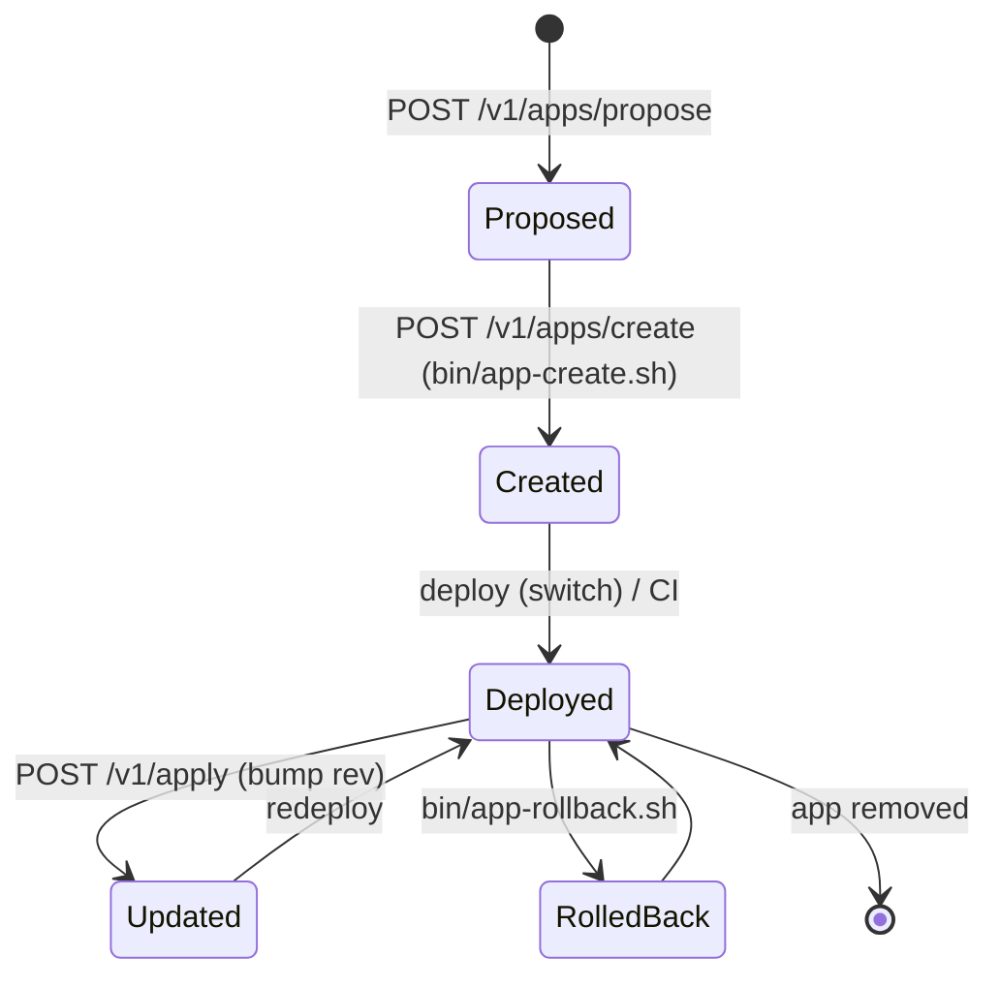

# Platform V2 — Reference

Durable platform configuration. Everything is declarative and version-controlled;
data and secret values are never stored in Git.

> **Type:** explanation · **Audience:** operator · **Last reviewed:** 2026-06-11

## Global configuration files

- `config/platform.nix` — host identity, storage classes, backup backend,
  default update policy, paths, default visibility.
- `config/policies.nix` — security/reproducibility rules, known permissions,
  backup coverage by criticality, `strict` mode.
- `config/catalogs.nix` — enabled workshop catalogs (empty by default).

`modules/platform.nix` validates these files (via assertions) and publishes them
read-only under `/etc/homelab/{platform,policies,catalogs}.json`. The
control-api and the CI validator (`control-api/cmd/validate-platform`) consume
these published files.

## App model

Apps live in `apps/*.nix` and are auto-discovered. `lib/app-model.nix`
normalizes both v1 and v2 declarations into a single internal model.

### v1 (compatibility, unchanged)

```nix
{ runner = "compose"; dir = ./whoami; port = 8088; }
```

### v2 (`schemaVersion = 2`)

```nix
{
  schemaVersion = 2;
  source = "workshop";              # local | workshop | nixpkgs | custom
  criticality = "high";             # low | medium | high | critical
  updatePolicy = "manual";          # manual | autoLow | critical
  runtime = {
    runner = "image";               # image | process | compose | dockerfile | nixos
    image = "traefik/whoami";
    tag = "v1.11.0";
    digest = "sha256:...";          # exact deployed version
    port = 3000;
  };
  permissions = [ "tailnet-port" "persistent-storage" "secret-access" ];
  volumes = [ { name = "data"; kind = "data"; class = "nas"; } ];
  secrets = [ { name = "ADMIN_PW"; required = true; } ];
  healthcheck = { type = "http"; path = "/api/health"; timeoutSec = 5; };
  dependencies = [ ];
}
```

`runner = "nixos"` consumes `module.systemdService` (the preferred native path).

### Dependencies (inter-app ordering)

`dependencies` lists other app names this app must start after.
`modules/apps.nix` turns each into a systemd `after` + `wants` on
`app-<dep>.service`, so a dependency starts (and is attempted) before its
dependents. It is a soft order (`wants`, not `requires`): a failing dependency
does not tear the dependent down — every app self-heals via
`Restart=on-failure`. The dependency graph is validated at eval time: a
dependency on an unknown app, or an app depending on itself, fails the build.
Declared dependencies surface in the control-api `GET /v1/apps/state` and the
web Apps screen ("après: …").

### Storage

Classes are defined in `config/platform.nix` (`local`, `nas`, `fast`, `cache`).
`lib/storage.nix` resolves `{class, app, volume}` into a path:
`nas + jellyfin + config -> /mnt/homelab/jellyfin/config`. Classes with
`backedUp = false` (for example `cache`) are excluded from backups.

### Secrets

Convention: `secrets/apps/<app>.yaml` (SOPS/age). Keys are stored in clear text,
values are encrypted. `modules/secrets.nix` auto-discovers and decrypts them to
`/run/secrets/<key>`. The API exposes only the status, never the value.

## Workshop

`workshop-lock.json` (repository root) pins each installed module to an exact
version:

```json
{ "modules": [
  { "module": "example", "catalog": "official", "version": "1.0.0",
    "repo": "https://github.com/org/catalog", "sha": "<40-hex>", "hash": "<nar-hash>" }
] }
```

A module with `source = "workshop"` and no lock entry is rejected by the
validator.

## Validation

`control-api/policy_engine.go` (runtime) and `control-api/cmd/validate-platform`
(CI, `nix flake check` plus evaluated manifests) enforce the same rules. Warn
mode is the default; `strict = true` turns reproducibility warnings (digest,
moving tag, non-SHA ref, healthcheck) into errors.

## App lifecycle

Apps move through the following states, driven by the control-api endpoints and
helper scripts:



- `POST /v1/apps/propose` generates the Nix declaration but does not write it.
- `POST /v1/apps/create` writes the proposal and runs `bin/app-create.sh`. When
  `deploy_mode` is `switch`, the change is pushed to `main`; otherwise a change
  branch is created.
- `POST /v1/apply` bumps the app to upstream `HEAD`, then redeploys.
- Rollbacks are performed via `bin/app-rollback.sh`.
- Staged changes are managed through the `/v1/changes/*` endpoints.
