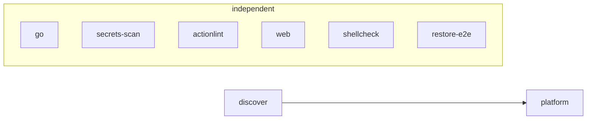
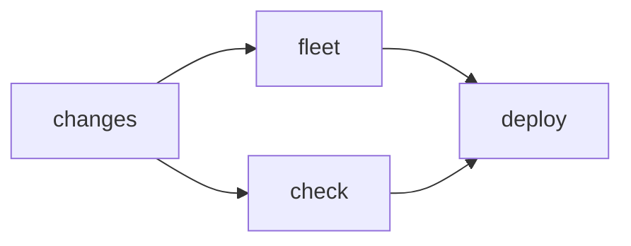

# CI/CD pipelines reference

Internals of the four GitHub Actions workflows: jobs, dependency graphs, triggers, and gating logic. For the operational deploy procedure see [deployment.md](deployment.md).

> **Type:** reference · **Audience:** developer · **Last reviewed:** 2026-06-11

## Workflow overview

| Workflow | Triggers | Purpose |
|---|---|---|
| [checks.yml](../.github/workflows/checks.yml) | `pull_request`, push to `main`, `workflow_dispatch` | Quality gate: Go, secrets, shell, web, Nix eval, restore e2e |
| [deploy.yml](../.github/workflows/deploy.yml) | push to `main`, `workflow_dispatch` (optional `host` input) | Continuous deployment over Tailscale SSH, per-host matrix |
| [release.yml](../.github/workflows/release.yml) | push of `v*.*` / `v*.*.*` tags | Publish a GitHub Release gated on the restore e2e VM test |
| [rollback.yml](../.github/workflows/rollback.yml) | `workflow_dispatch` (`host`, `ssh_host`, `generation`) | Manual NixOS generation rollback on a host |

## checks.yml

Eight jobs, all independent except `platform`, which fans out over the host list produced by `discover`.

| Job | Needs | Purpose | Key steps |
|---|---|---|---|
| `go` | — | Go quality gate for `control-api/` | `go vet`, `go test ./...`, staticcheck v0.7.0, govulncheck (advisory, `continue-on-error`), gofmt cleanliness, build `./cmd/validate-platform` |
| `secrets-scan` | — | Leak detection over full git history | gitleaks CLI (pinned version, `fetch-depth: 0`), config in `.gitleaks.toml`, `--redact --exit-code 1` |
| `actionlint` | — | Validate workflow YAML on every PR (deploy/rollback only run on `main`, so a malformed file would otherwise reach `main` unparsed) | actionlint with shell/pyflakes linting of `run:` blocks disabled |
| `web` | — | Web UI builds | `npm ci` + `npm run build` in `web/` (Node 20) |
| `shellcheck` | — | Lint operational scripts | `shellcheck --severity=warning bin/*.sh` |
| `discover` | — | Enumerate `hosts/<name>/` dirs with a `configuration.nix` | Emits a JSON array as the `hosts` output for the platform matrix |
| `restore-e2e` | — | Backup→restore round-trip gate (v0.6 T2) | `nix build --impure -L .#checks.x86_64-linux.restore-e2e` (KVM VM test, see [reference-tests.md](reference-tests.md)) |
| `platform` | `discover` | Full-fleet eval + manifest validation, one matrix leg per host, `fail-fast: false` | Prepare per-host `.env` from the example, `nix flake check --impure --no-build`, `nix eval` the `apps.json`/`policies.json`/`platform.json` manifests, then `go run ./cmd/validate-platform ... --strict` |

Notes:

- `restore-e2e` is kept out of `platform`'s `nix flake check --no-build` because it needs an actual VM build and KVM (`system-features = nixos-test ... kvm`).
- govulncheck is advisory by design: stdlib advisories land before the fixed Go patch ships.

## deploy.yml

| Job | Needs | Purpose | Key steps |
|---|---|---|---|
| `changes` | — | Classify the push diff | Diffs `github.event.before..sha`; outputs `deploy`, `infra`, `shared` (host-independent change ⇒ whole fleet), `changed_hosts` (only `hosts/<name>/` paths). `*.md`-only changes do not deploy. Unknown diff (dispatch/first push) ⇒ treated as shared |
| `fleet` | `changes` | Build the deploy matrix | Parses the `FLEET` repo variable (default `[{"host":"homelab"}]`) through python for validation; applies the dispatch single-host filter and, when `shared=false`, intersects with `changed_hosts`; exposes `matrix` and `count` |
| `check` | `changes` | Eval gate, runs only when `infra == 'true'` | `bin/check-env.sh .env.example .env`, then `nix flake check --impure --no-build` |
| `deploy` | `fleet`, `changes`, `check` | Per-host deployment (matrix, `fail-fast: false`, concurrency group `deploy-<host>`) | Resolve SSH target and remote `.env` path; enforce host-key verification (`SSH_KNOWN_HOSTS` secret required unless `ALLOW_TOFU=true`); join the tailnet; write `.env` on the host; provision the git token to a host file; `git reset --hard` to the workflow SHA; dispatch [deploy.sh](../bin/deploy.sh) detached via `systemd-run --unit=ci-deploy`; poll the unit (survives tailscaled restarts); verify `deployed-commit`, `/healthz`, `/v1/deployments`, and that `/v1/status` reports the expected host |

The `deploy` job runs even when `check` was skipped (docs/web-only change): its `if:` accepts `needs.check.result == 'skipped'`, and `count != '0'` lets an empty matrix skip cleanly instead of hard-failing.

## release.yml

| Job | Needs | Purpose | Key steps |
|---|---|---|---|
| `restore-e2e` | — | Tag releases only publish if the backup→restore VM test passes | Same job shape as the checks.yml `restore-e2e` job |
| `release` | `restore-e2e` | Publish the GitHub Release for the tag | Uses `docs/changelog/<tag>.md` as notes when present (`gh release create --verify-tag`, or `edit` if the release exists); falls back to `--generate-notes`. Existence is checked explicitly so auth/network failures cannot be silently swallowed |

The private repo's releases are the source of truth; the public mirror is published separately by the release script (see [versioning.md](versioning.md)).

## rollback.yml

Single `rollback` job, manual only. It shares the `deploy-<host>` concurrency group with deploy.yml so a rollback never races an in-flight deploy.

| Job | Needs | Purpose | Key steps |
|---|---|---|---|
| `rollback` | — | Roll a host back to the previous (or a specific) NixOS generation | Host-key setup (TOFU fallback with warning), tailnet join, then either `nixos-rebuild switch --rollback` or, with a validated numeric `generation` input, `nix-env --profile /nix/var/nix/profiles/system --switch-generation N` + `switch-to-configuration switch` |

## Related pages

- [deployment.md](deployment.md) — how to deploy and operate the pipeline
- [reference-bin-internals.md](reference-bin-internals.md) — what `deploy.sh` and `check-env.sh` do on the host
- [reference-tests.md](reference-tests.md) — the suites these pipelines run
