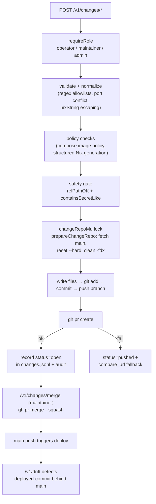

# Control API: change gateway and policy engine

Implementation reference for the GitOps change path: every durable mutation the UI offers becomes a reviewed pull request, generated server-side and gated by validation, a secret scan, a path allowlist and the policy engine. Endpoint contracts are in [api.md](api.md).

> **Type:** reference · **Audience:** developer · **Last reviewed:** 2026-06-11

## Files

| File | Role |
| --- | --- |
| [change_gateway.go](../control-api/change_gateway.go) | Core PR pipeline: request validation/normalization, Nix file generation, the shared change working tree, branch/commit/push/`gh pr create`, change records (`changes.jsonl`), retry/merge/close/prune |
| [change_config.go](../control-api/change_config.go) | PR change types that edit config files: whole-file edits (platform/policies), structured Nix splicing (catalog add/update/remove, storage class add/remove, per-volume storage retarget), access.json role grants, raw config read, live PR status refresh |
| [change_ext.go](../control-api/change_ext.go) | Platform V2 change types: SOPS-encrypted per-app secrets, updatePolicy/criticality edits, workshop installs (v2 module + workshop-lock.json) |
| [change_safety.go](../control-api/change_safety.go) | Pure safety predicates: `relPathOK` path allowlist, `containsSecretLike`/`secretValueLike` plaintext-secret scan |
| [policy.go](../control-api/policy.go) | Runtime action risk model: `actionPolicy` classifies start/stop/restart per target as safe/risky/blocked |
| [policy_engine.go](../control-api/policy_engine.go) | Pure policy validator shared with the CI validator: app manifest + policies → `[]Violation` |
| [drift.go](../control-api/drift.go) | Deployed-commit vs origin/main drift, cached 15 min |

## Change request lifecycle

## change_gateway.go — the PR pipeline

Key building blocks:

- **`appChangeRequest` → `generateAppFiles`** — `normalizeAppChange` infers mode (image/process/dockerfile/compose) and app name from the source; `validateAppChange` enforces allowlist regexes (`reNewAppName`, `reBranchSafe`, `reDockerImage`, `reGitURL`), port range and conflict, package and env-key shape (env keys become raw Nix attribute names, so they must match `reSecretKey`). Generation delegates to `generateAppModule` ([apps_api.go](../control-api/apps_api.go)), where `nixString` escapes `\`, `"` and `$` so untrusted values cannot become Nix interpolation.
- **`validateComposeImages`** — the policy engine only sees apps.json, so compose files are gated at proposal time: each `image:` line is parsed by `splitComposeImageRef` and checked against the image policy (digest pinning, moving-tag ban, registry allowlist).
- **`prepareChangeRepo`** — one shared working tree at `<state>/repo`, serialized by `changeRepoMu`. Every change starts by fetching main, `reset --hard FETCH_HEAD` and `clean -fdx` (self-healing after crashes), then `checkout -B <branch>`.
- **`gitEnv`** — the git token (`/run/secrets/git_token`, `HOMELAB_GIT_TOKEN_FILE`) rides only in the environment as a github.com-scoped `extraHeader` with redirects disabled; never in argv or on disk.
- **`createPRChange`** — write files → `git add` → reject no-op diffs → commit as `homelab-control` → push → `gh pr create`. A deferred cleanup always resets the tree to main. If PR creation fails after a successful push, the record gets status `pushed` plus a `compare_url` so the operator can open the PR by hand.
- **`rebuildChangeBranch`** — used by retry: replays the change's recorded file paths from the old branch tip (or recorded commit) onto current main, then force-pushes; this survives a rewritten main history.
- **Change records** — append-only `changes.jsonl` in the state dir (`changeRecord`: id, type, actor, branch, commit, PR number/URL, status, files). `readChangeRecords` caps at 200 and returns newest-first; `changesPruneHandler` (admin) rewrites the file atomically, dropping failed or named records without touching the referenced branches/PRs.

Handlers in this file: `appAddPreviewHandler`, `appAddChangeHandler`, `appRemoveChangeHandler` (stages file deletions), `appUpdateChangeHandler` / `appRollbackChangeHandler` (both via `replaceAppVersion`, which rewrites the `rev`/`tag` scalar; rollback requires maintainer and a reason), `changesHandler`, `changesPruneHandler`, `catalogHandler`, `appsListHandler`.

## change_config.go — config-file change types

- **`createFileEditPR` / `fileEditHandler`** — generic single-file replace behind `relPathOK`; JSON files are parse-checked first. Used directly for `platform.config` and `policy.config` (both admin).
- **Structured Nix generation** — catalog entries and storage classes used to be client-generated Nix (injection risk). Now the server builds the entry itself: atoms through strict regexes, free text through `nixSafeText` + `nixString`, and `spliceIntoNixBlock` inserts by index (never regex replacement, so escaped `$`/`\` cannot act as metacharacters). Pure helpers `buildCatalogEntry`, `replaceCatalogEntry`, `buildStorageClassEntry`, `removeStorageClassEntry`, `retargetVolumeClass` are all unit-tested against injection payloads.
- **Guard rails** — `storageClassRemoveHandler` refuses to remove the default class or any class still referenced by an app volume; `accessRoleChangeHandler` mutates the users map of `config/access.json` structurally (no hand-edited JSON) and validates role names and identities.
- **PR status** — `changesRefreshHandler` enriches records with live GitHub state via `prGitHubStatus`, which falls back from `statusCheckRollup` (needs Checks read) to synthesizing the rollup from `gh run list --commit` (needs only Actions read). `changesRetryHandler` rebuilds the branch and re-attempts PR creation; `changesMergeHandler` (maintainer) merges with `--squash --delete-branch`, gated on GitHub's own mergeability; `changesCloseHandler` (operator) closes and deletes the branch.

## change_ext.go — secrets, app policy, workshop installs

- **`encryptSecretSOPS`** — encrypts plaintext YAML with sops/age (recipient from `AGE_RECIPIENT` or `.sops.yaml`); plaintext is piped on stdin, never written to disk. The output is refused unless it visibly contains `ENC[` and `sops:`, and no plaintext line may survive verbatim in the ciphertext. PR bodies list key names only.
- **`appSecretChangeHandler`** — writes `secrets/apps/<app>.yaml` (ciphertext) via PR; `secretPlaintextYAML` JSON-encodes values for safe YAML.
- **`appPolicyChangeHandler`** — changes `updatePolicy` or `criticality` via `replaceAppScalar` (rewrite or insert a scalar key in the app's Nix file, read from a fresh clone).
- **`appInstallChangeHandler`** — workshop install: `validateInstall` requires a pinned 40-char commit SHA (no moving refs), validates runner-specific fields, volumes, secrets and health path; `generateV2Module` renders a `schemaVersion = 2` module (healthcheck mandatory) and `mergeWorkshopLock` updates `workshop-lock.json`. Both paths re-checked by `relPathOK`.

## change_safety.go — guard predicates

- **`relPathOK`** — rejects absolute paths and `..` traversal, then allows only: `workshop-lock.json`, the four config files (`config/platform.nix`, `config/policies.nix`, `config/catalogs.nix`, `config/access.json`), `secrets/apps/*.yaml` (SOPS ciphertext only) and `apps/*.nix` / `apps/*/docker-compose.yml`. Every generated path passes through it twice: at generation and again in `writeGeneratedFiles`.
- **`containsSecretLike`** — refuses changes whose env keys look secret-named (SECRET/TOKEN/PASSWORD/KEY) or whose values/files/free-form commands match `secretValueLike` (GitHub tokens, AWS keys, Slack tokens, Google API keys, PEM headers, inline `password =`). Secrets must go through SOPS.

## policy_engine.go — pure validation

`Validate(name, app, pol, ctx)` runs every rule against one app; `ValidateAll` fans out; `hasErrors` summarizes. `PolicyContext` (from `newPolicyContext`) carries which storage classes exist and which are backed up. Default posture is deny; `escalate` turns soft warnings into errors when `policies.strict` is set. Rules:

| Code | Severity | Rule |
| --- | --- | --- |
| `unknown-permission` / `unknown-criticality` / `unknown-update-policy` | error | structural validity against known sets |
| `unknown-storage-class` | error | volume class must exist |
| `database-on-ephemeral` | error | database volume on a non-backed-up class |
| `backup-class-required` | warning→error (strict) | backup-required criticality needs a volume on a backed-up class |
| `privileged-container` / `host-root-mount` / `docker-socket` | warning | dangerous capabilities flagged when explicitly requested |
| `public-port-forbidden` | error | `public-port` permission vs `ports.allowPublic` |
| `reserved-port` | warning→error (strict) | platform-reserved ports |
| `image-no-digest` / `bad-digest` / `moving-tag` / `registry-not-allowed` | mixed | image reproducibility and supply-chain provenance |
| `non-sha-ref` | warning→error (strict) | process/dockerfile git refs must be commit SHAs |
| `missing-backup` / `missing-restore-test` | error / warning→error | backup coverage by criticality |
| `database-automerge` | error | database volumes cannot ride `updatePolicy=autoLow` |
| `missing-healthcheck` / `critical-no-healthcheck` | warning→error (strict) | v2 apps and critical apps must declare a healthcheck |

Violations carry a `Hint` with the remediation, surfaced in change previews and `/v1/policies` (see [reference-control-api-handlers.md](reference-control-api-handlers.md)).

## policy.go — runtime action risk

`actionPolicy(kind, target, op)` classifies runtime operations: critical units (`sshd`, `tailscaled`, network, firewall) and `control-api.service` are blocked; app-unit stop and container stop are `risky` (double-confirm); `docker.service` allows only restart (risky); everything else off-allowlist is blocked. `actionsForTarget` precomputes the spec list the UI renders per target.

## Double-confirm mechanics

Risky operations (stop, reboot, deploy switch/rollback, restore, purge) go through `requireDoubleConfirm` ([state.go](../control-api/state.go)): the first call stores a challenge keyed by `confirmKey(...)` and answers `409` with a `confirm_id` and message; the client must repeat the identical request with that id within 10 seconds. Ids are single-use and generated by `randomID` (crypto/rand, panics rather than degrade). The "armed" state is itself audited.

## drift.go — post-merge drift detection

`driftHandler` (`GET /v1/drift`) compares `<state>/deployed-commit` with `git ls-remote` of `REPO_URL`, behind a 15-minute in-process cache keyed on the last *attempt* (a failing remote is not re-hit on every UI poll). `?refresh=1` (operator) bypasses the cache. A failed lookup never refreshes `checked_at`, so `stale=true` (older than 30 min or empty main commit) is exactly how repeated failures surface.

## Related pages

- [api.md](api.md) — endpoint contract
- [reference-control-api-handlers.md](reference-control-api-handlers.md) — mux, auth, read-only handlers
- [security.md](security.md) — overall threat model
