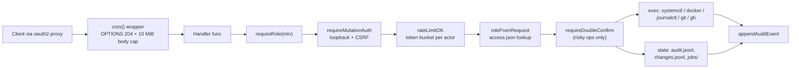

# Control API: handler reference

Per-file implementation map of the HTTP-serving files in [control-api/](../control-api/): what each file owns, its key functions, the routes it serves and what it depends on. The HTTP contract (request/response shapes) lives in [api.md](api.md); this page documents how those endpoints are implemented.

> **Type:** reference · **Audience:** developer · **Last reviewed:** 2026-06-11

## Request flow

Every route is registered in [main.go](../control-api/main.go) wrapped in the `cors()` middleware. Mutating handlers then call into the auth chain from [authz.go](../control-api/authz.go) before touching state or executing commands.

## main.go — mux wiring and legacy actions

[main.go](../control-api/main.go) holds `main()` (route table, `http.Server` with `ReadHeaderTimeout` 10s / `ReadTimeout` 60s / no `WriteTimeout` so log streaming works), the `cors()` middleware, shared helpers (`writeJSON`, `decodeJSON`, `runCmd`, `gitToken`, `lsRemote`) and the legacy runtime handlers.

| Function | Route | Role | Notes |
| --- | --- | --- | --- |
| `actionHandler` | `POST /v1/action` | operator | start/stop/restart of `app-*.service` units and containers; risk classified by `actionPolicy` (policy.go); risky ops double-confirm; result verified by `verifyService`/`verifyContainer` polling |
| `rebootHandler` | `POST /v1/reboot` | admin | double-confirm, then `systemctl reboot` |
| `deployHandler` | `POST /v1/deploy` | admin | double-confirm, delegates to `startDeploymentJob` (deployments.go) |
| `applyHandler` | `POST /v1/apply` | operator | returns `410 Gone` — direct apply disabled in favor of `/v1/changes/app-update` |
| `updateCheckHandler` | `GET /v1/update-check` | — | deployed-commit file vs `git ls-remote` (token-authenticated via `lsRemote`) |
| `updatesHandler` | `GET /v1/updates` | — | per-app behind/up-to-date from `apps.json` revs vs remote HEAD |
| `statusHandler` | `GET /v1/status` | — | host, generation, deploy state, build version |
| `metricsHandler` | `GET /metrics` | — | minimal Prometheus text format |

Path helpers `homelabDir()`, `sourceDir()` (read-only nix-store source copy, `HOMELAB_SOURCE_DIR`), `appsManifestPath()` and the `systemctl`/`dockerBin` constants also live here. Depends on: authz.go, state.go, policy.go, deployments.go, spa.go.

## authz.go — authentication, authorization, rate limiting

[authz.go](../control-api/authz.go) is the security boundary. Identity comes only from headers oauth2-proxy injects (`X-Forwarded-Email` / `X-Forwarded-User`); client-supplied role headers are never trusted. There is no machine/service-token path — every caller crosses the same oauth2-proxy front door.

| Function | Purpose |
| --- | --- |
| `requireMutationAuth` | Caller must arrive over loopback (behind oauth2-proxy) with an `X-HL-CSRF` header |
| `roleFromRequest` | Look up the actor (`X-Forwarded-Email`) in `config/access.json` (`HOMELAB_ACCESS_FILE`, default `/etc/homelab/access.json`), falling back to `default_role` (viewer) |
| `requireRole` | `requireMutationAuth` + role-level comparison (`viewer < operator < maintainer < admin`); failures are audited and answered 403 |
| `allowMutation` / `rateLimitOK` | Per-actor token bucket on mutations: 1 req/s refill, burst 30; disable with `CONTROL_API_RATE_LIMIT=off`; idle buckets are pruned |

`readAccessConfig` re-reads access.json on every request — role changes (merged via `/v1/changes/access-role`) take effect without restart.

## Read-only and runtime view files

| File | Role | Routes | Key functions | Depends on |
| --- | --- | --- | --- | --- |
| [api_readonly.go](../control-api/api_readonly.go) | Viewer-accessible platform domains; never mutates | `GET /v1/platform`, `/v1/policies`, `/v1/storage`, `/v1/library` | `platformHandler`, `policiesHandler` (runs `ValidateAll` for live violations), `storageHandler`, `libraryHandler`, `loadWorkshopLock` | platform.go, policy_engine.go |
| [apps_state.go](../control-api/apps_state.go) | Enriched per-app view: desired (Git manifest) vs runtime (systemd), drift, storage/secrets/backup/policy status | `GET /v1/apps/state` | `appsStateHandler` — joins `loadManifestApps`, `listServices`, `secretsStatusForApps`, `backupCoverage`, `Validate` | platform.go, targets.go, secrets.go, backups.go, policy_engine.go |
| [health.go](../control-api/health.go) | Runs manifest-declared healthchecks (http or tcp against `127.0.0.1:<port>`, capped 30s timeout) | `GET /v1/health/apps`, `POST /v1/health/check` (operator) | `runHealthcheck`, `healthAppsHandler`, `healthCheckNowHandler` | platform.go |
| [logs.go](../control-api/logs.go) | Recent journald logs for one managed app unit | `GET /v1/logs?app=` (operator) | `logsHandler` — validates app name, `journalctl -u app-<name>.service -n 200` with 10s timeout | authz.go |
| [library.go](../control-api/library.go) | Workshop catalogue browsing: shallow-clones the catalogue repo at its pinned ref into the state dir, serves its `catalog.json` | `GET /v1/library/catalog/<id>` | `loadCatalogEntries`, `ensureCatalogClone` (clone/fetch/checkout with `GIT_TERMINAL_PROMPT=0`), `libraryCatalogHandler` | platform.go, state.go, change_gateway.go (`commandRunner`) |
| [spa.go](../control-api/spa.go) | Serves the React bundle from `WEB_ROOT` with SPA fallback to index.html; path-traversal guarded; ETag derived from the store path so a new build busts the cache | `GET /` (catch-all), `GET /v1/me` | `spaHandler`, `meHandler` (identity + resolved role for UI gating) | authz.go |
| [state.go](../control-api/state.go) | State-dir plumbing (`/var/lib/homelab`, `HOMELAB_STATE_DIR`): audit log append/rotate/query, double-confirm challenge store, job specs, `randomID` | `GET /v1/audit` (operator) | `appendAuditEvent` (file + `HL_AUDIT` journald mirror for tamper evidence), `rotateAuditIfNeeded` (5 MiB → `.1`), `readAuditEvents`, `requireDoubleConfirm`, `writeJobSpec`, `actorFromRequest` | — (everyone depends on it) |
| [targets.go](../control-api/targets.go) | Lists running app services, containers and infra units for the runtime UI | `GET /v1/targets` | `listServices` (`systemctl list-units app-*.service`, enriched from apps.json), `listContainers` (`docker ps -a`), `listInfra`, `targetsHandler` | main.go (constants), policy.go (`actionsForTarget`) |
| [deployments.go](../control-api/deployments.go) | Deploy job lifecycle: history (`deployments.jsonl`), live `hl-deploy@*`/`hl-backup@*` units, job start | `GET/POST /v1/deployments` (GET operator; POST switch/rollback admin + double-confirm, others operator) | `startDeploymentJob` (writes a job spec then `systemctl start --no-block hl-deploy@<id>`), `readDeploymentHistory`, `listDeployJobs`, `deploymentLogs` (allowlisted unit names) | state.go, authz.go |
| [platform.go](../control-api/platform.go) | Typed loaders for the manifests published by the Nix modules under `/etc/homelab/` — no HTTP routes of its own | — | `loadPlatform`, `loadPolicies`, `loadCatalogsRaw`, `loadManifestApps`, `hostname()` (platform.json hostname → OS hostname → "homelab"); defines `Platform`, `Policies`, `ManifestApp`, `Volume`, `SecretRef`, `Healthcheck` | — |

## Confirm and risk model (shared)

- `actionPolicy` in [policy.go](../control-api/policy.go) classifies every runtime op as `safe`, `risky` (requires `confirm: "double"`) or `blocked` (critical units, control-api itself, non-allowlisted services).
- `requireDoubleConfirm` in [state.go](../control-api/state.go) answers the first call with `409` + a `confirm_id` valid 10 seconds; the client repeats the request with that id to execute. Used by reboot, deploy switch/rollback, stop actions, backup restore and data purge.

## Related pages

- [api.md](api.md) — endpoint contract (paths, payloads, status codes)
- [reference-control-api-changes.md](reference-control-api-changes.md) — the GitOps change gateway
- [reference-control-api-system.md](reference-control-api-system.md) — system metrics, observability, backups, secrets
