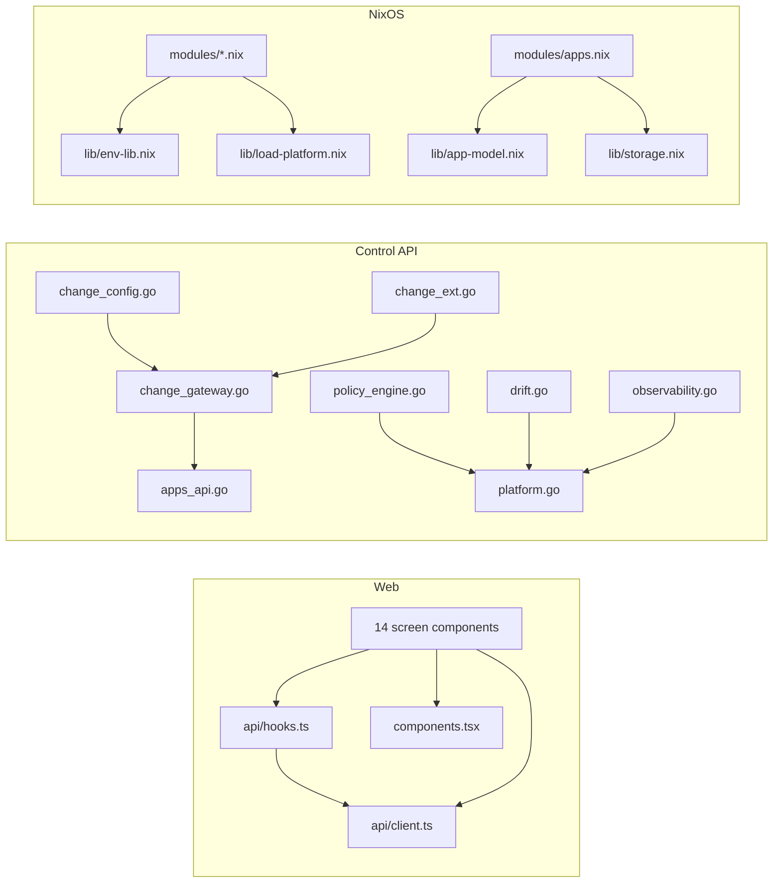

# Dependency map

This page is a cross-component dependency reference derived from the repository knowledge graph (534 nodes, 661 edges): edge statistics, the highest fan-in files, configuration flow, and test coverage pairs. For the layer-by-layer view, see [reference-layers](reference-layers.md).

> **Type:** reference · **Audience:** developer · **Last reviewed:** 2026-06-11

## Edge-type statistics

| Edge type | Count | Meaning |
| --- | --- | --- |
| contains | 349 | File contains a function/class/type |
| depends_on | 77 | Component requires another at build or run time |
| imports | 60 | Source-level import statement |
| documents | 52 | Documentation page describes a component |
| exports | 48 | File exposes a public symbol |
| related | 31 | Loose conceptual association |
| tested_by | 17 | Production file covered by a test file |
| calls | 16 | Function-level invocation |
| configures | 7 | Config file shapes a component's behavior |
| triggers | 4 | CI workflow launches a script or test |

## Top file-to-file dependencies

The graph's dependency hot spots cluster around three hubs: the web data layer (`hooks.ts`/`client.ts`/`components.tsx`), the control-api change gateway and platform model, and the shared Nix libraries under `lib/`.

## High fan-in files

Files most depended upon, computed from incoming `depends_on`, `imports`, and `calls` edges.

| File | Fan-in | Why it is central |
| --- | --- | --- |
| [web/src/api/hooks.ts](../web/src/api/hooks.ts) | 24 | Every screen fetches data through its React Query hooks |
| [web/src/components.tsx](../web/src/components.tsx) | 16 | Shared UI primitives used by all screens |
| [web/src/api/client.ts](../web/src/api/client.ts) | 12 | Single HTTP transport with confirm-challenge flow |
| [lib/env-lib.nix](../lib/env-lib.nix) | 7 | Typed `.env` accessors used by most NixOS modules |
| [lib/load-platform.nix](../lib/load-platform.nix) | 6 | Platform merge consumed by apps, backup, alerting, observability, platform modules |
| [control-api/platform.go](../control-api/platform.go) | 4 | Platform data model behind drift, observability, secrets, policy engine |
| [lib/app-model.nix](../lib/app-model.nix) | 3 | App normalizer shared by `modules/apps.nix`, `modules/backup.nix`, tests |
| [config/platform.nix](../config/platform.nix) | 3 | Declarative platform config read by Nix modules and `api_readonly.go` |
| [control-api/change_gateway.go](../control-api/change_gateway.go) | 2 | Git/gh plumbing reused by `change_config.go` and `change_ext.go` |
| [hosts/homelab/configuration.nix](../hosts/homelab/configuration.nix) | 2 | Base host config reused by the obstest eval host and the flake |

Changes to any file in this table fan out widely; treat them as high-blast-radius edits and run the corresponding test suites (see below).

## Configuration flow

All `configures` edges in the graph. Two families stand out: build manifests configuring their entry points, and operational config feeding runtime behavior.

| Config file | Configures | Effect |
| --- | --- | --- |
| [config/access.json](../config/access.json) | [authz.go](../control-api/authz.go) | Role hierarchy for control-api authorization |
| [secrets/homelab.yaml](../secrets/homelab.yaml) | [modules/secrets.nix](../modules/secrets.nix) | SOPS-encrypted keys enumerated at eval time |
| [control-api/go.mod](../control-api/go.mod) | [main.go](../control-api/main.go) | Go module and dependency pinning |
| [web/package.json](../web/package.json) | [main.tsx](../web/src/main.tsx) | SPA build dependencies and scripts |
| [web/tsconfig.json](../web/tsconfig.json) | [main.tsx](../web/src/main.tsx) | TypeScript compilation of the SPA |

Related `triggers` edges complete the picture of how CI wires into the repo:

| Workflow | Triggers |
| --- | --- |
| [checks.yml](../.github/workflows/checks.yml) | [restore-e2e.nix](../tests/restore-e2e.nix) |
| [deploy.yml](../.github/workflows/deploy.yml) | [check-env.sh](../bin/check-env.sh), [deploy.sh](../bin/deploy.sh) |
| [release.yml](../.github/workflows/release.yml) | [restore-e2e.nix](../tests/restore-e2e.nix) |

## Test coverage

All `tested_by` pairs. Coverage is concentrated in the Control API; the Nix layer is covered separately by the eval-time tests under `tests/` (see [reference-layers](reference-layers.md)).

| Production file | Covered by |
| --- | --- |
| [main.go](../control-api/main.go) | [main_test.go](../control-api/main_test.go), [change_lifecycle_v06_test.go](../control-api/change_lifecycle_v06_test.go), [install_test.go](../control-api/install_test.go) |
| [platform.go](../control-api/platform.go) | [platform_test.go](../control-api/platform_test.go), [multihost_test.go](../control-api/multihost_test.go) |
| [policy_engine.go](../control-api/policy_engine.go) | [policy_engine_v03_test.go](../control-api/policy_engine_v03_test.go), [platform_test.go](../control-api/platform_test.go) |
| [change_safety.go](../control-api/change_safety.go) | [change_safety_test.go](../control-api/change_safety_test.go), [main_test.go](../control-api/main_test.go) |
| [change_gateway.go](../control-api/change_gateway.go) | [change_gateway_compose_test.go](../control-api/change_gateway_compose_test.go) |
| [change_config.go](../control-api/change_config.go) | [change_config_test.go](../control-api/change_config_test.go) |
| [drift.go](../control-api/drift.go) | [drift_test.go](../control-api/drift_test.go) |
| [library.go](../control-api/library.go) | [library_v05_test.go](../control-api/library_v05_test.go) |
| [observability.go](../control-api/observability.go) | [multihost_test.go](../control-api/multihost_test.go) |
| [policy.go](../control-api/policy.go) | [main_test.go](../control-api/main_test.go) |
| [state.go](../control-api/state.go) | [main_test.go](../control-api/main_test.go) |
| [system.go](../control-api/system.go) | [ui_endpoints_test.go](../control-api/ui_endpoints_test.go) |
