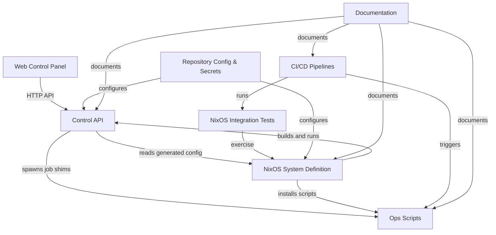

# Architectural layers

This page enumerates the eight architectural layers of the repository, the key files in each, and how the layers connect to one another. For the narrative system design, see [architecture](architecture.md); for the edge-level view, see [reference-dependency-map](reference-dependency-map.md).

> **Type:** reference · **Audience:** developer · **Last reviewed:** 2026-06-11

## Layer overview

| Layer | Nodes | Role |
| --- | --- | --- |
| Web Control Panel | 25 | React/Vite SPA for operating the platform |
| Control API | 43 | Go HTTP server: lifecycle, change gateway, policy engine |
| NixOS System Definition | 32 | Declarative system: flake, hosts, modules, libs, config |
| NixOS Integration Tests | 6 | Eval-time and VM tests for the Nix layer |
| Ops Scripts | 14 | Operational shell scripts invoked by CI and the control plane |
| CI/CD Pipelines | 4 | GitHub Actions workflows |
| Documentation | 47 | Diátaxis docs, changelogs, roadmaps |
| Repository Config & Secrets | 12 | SOPS, gitleaks, Renovate, env templates, lockfiles |

## Web Control Panel

React 18/Vite single-page control panel: a typed API client, React Query hooks, and operational screens (Apps, Backups, Monitoring, Security, Changes, Settings) talking to the control-api.

| File | Role |
| --- | --- |
| [client.ts](../web/src/api/client.ts) | Fetch-based HTTP client with typed GET/POST, `ApiError`, and confirm-challenge flow for risky mutations |
| [hooks.ts](../web/src/api/hooks.ts) | React Query hook per control-api endpoint; the single data-access layer for all screens |
| [App.tsx](../web/src/App.tsx) | Root shell: hash router, role-gated navigation, global status chips |
| [components.tsx](../web/src/components.tsx) | Shared UI library: badges, buttons, metric cards, tabs, dialogs, action menu |
| [Apps.tsx](../web/src/screens/Apps.tsx) | App management: search, bulk start/stop, per-app actions |
| [Changes.tsx](../web/src/screens/Changes.tsx) | Pending GitOps changes with CI check-run status and approve/apply actions |
| [Settings.tsx](../web/src/screens/Settings.tsx) | Access roles, platform/policy configuration, catalog management |
| [AddAppDialog.tsx](../web/src/screens/AddAppDialog.tsx) | New-app wizard covering image, git, compose, and process modes |

Connections: every screen imports `hooks.ts` and `components.tsx`; all network traffic flows through `client.ts` to the Control API. The SPA build is served back by the Control API's `spa.go`.

## Control API

Go HTTP server backing the panel: app lifecycle, a GitOps change gateway with a policy engine and guarded actions, backups, drift detection, and system operations, with co-located Go tests.

| File | Role |
| --- | --- |
| [main.go](../control-api/main.go) | Entry point wiring routes, auth middleware, CORS, audit, action verification |
| [change_gateway.go](../control-api/change_gateway.go) | Core GitOps gateway: change persistence, git/gh plumbing, compose image policy |
| [policy_engine.go](../control-api/policy_engine.go) | Validates manifest apps against platform policies, producing severity-graded violations |
| [policy.go](../control-api/policy.go) | Action policy table classifying actions as safe, risky, or blocked |
| [authz.go](../control-api/authz.go) | Role resolution and hierarchy from `config/access.json` |
| [platform.go](../control-api/platform.go) | Platform data model and loaders; depended on by drift, observability, secrets, policy engine |
| [state.go](../control-api/state.go) | Persistent job spec storage and audit event append/rotation/query |
| [apps_api.go](../control-api/apps_api.go) | App creation: validation plus safe generation of `apps/<name>.nix` |
| [backups.go](../control-api/backups.go) | Backup results, per-app coverage, log serving |
| [system_ops.go](../control-api/system_ops.go) | Operator handlers: SOPS rotation via PR, generations, infra logs, audit pruning |

Connections: serves the Web Control Panel; reads generated JSON from the NixOS layer (`/etc/homelab` outputs of `config/platform.nix`, `policies.nix`, `catalogs.nix`); delegates privileged work to root shims in Ops Scripts (`bin/hl-backup-run`, `bin/hl-deploy-run`); is itself built and run by `modules/control-api.nix`.

## NixOS System Definition

Declarative NixOS layer: flake entrypoint, host configurations, reusable Nix libraries, system modules (docker, networking, observability, secrets), app definitions, and platform/policy/catalog configuration.

| File | Role |
| --- | --- |
| [flake.nix](../flake.nix) | Flake entry pinning nixpkgs and sops-nix; auto-discovers `hosts/<name>/` |
| [configuration.nix](../hosts/homelab/configuration.nix) | Main host configuration: admin user, SSH keys, module imports |
| [app-model.nix](../lib/app-model.nix) | Normalizes v1 and v2 app definitions onto one internal shape |
| [load-platform.nix](../lib/load-platform.nix) | Deep-merges platform base with per-host overlays |
| [env-lib.nix](../lib/env-lib.nix) | Typed accessors over the parsed `.env`; used by most modules |
| [apps.nix](../modules/apps.nix) | Core app deployment: discovers `apps/`, resolves storage, generates units |
| [platform.nix](../modules/platform.nix) | Validates platform/policies/catalogs and publishes them read-only |
| [secrets.nix](../modules/secrets.nix) | SOPS wiring enumerating keys in `secrets/` at eval time |
| [control-api.nix](../modules/control-api.nix) | Builds and runs the Go control-api as a NixOS service |
| [policies.nix](../config/policies.nix) | Default-deny platform policy rules |

Connections: consumes Repository Config & Secrets (`.env`, `secrets/homelab.yaml`); builds and configures the Control API; installs Ops Scripts onto the host; exercised by the NixOS Integration Tests layer.

## NixOS Integration Tests

Nix-based eval-time and VM tests covering the app model, catalogs, storage, multi-host setups, and backup restore.

| File | Role |
| --- | --- |
| [default.nix](../tests/default.nix) | Flake-check entry wiring each eval-time test into derivations |
| [app-model.nix](../tests/app-model.nix) | v1 and schemaVersion-2 normalization paths of `lib/app-model.nix` |
| [storage.nix](../tests/storage.nix) | Storage class resolution against the platform configuration |
| [multi-host.nix](../tests/multi-host.nix) | Platform merge behavior in `lib/load-platform.nix` |
| [catalog.nix](../tests/catalog.nix) | Mirrors catalog schema assertions in `modules/platform.nix` |
| [restore-e2e.nix](../tests/restore-e2e.nix) | NixOS VM test proving the restic backup/restore round-trip |

Connections: depends directly on the NixOS System Definition libraries it tests; `restore-e2e.nix` is triggered by the `checks.yml` and `release.yml` CI workflows.

## Ops Scripts

Operational shell scripts (deploy, backup, install, secret rotation, key escrow, app lifecycle) that the control plane and CI invoke.

| File | Role |
| --- | --- |
| [deploy.sh](../bin/deploy.sh) | Main GitOps deploy: repo sync, `nixos-rebuild switch` with rollback guard |
| [install.sh](../bin/install.sh) | One-script bootstrap of a host on fresh NixOS |
| [backup.sh](../bin/backup.sh) | Restic wrapper used by control-api actions and generated services |
| [rotate-secrets.sh](../bin/rotate-secrets.sh) | Re-encrypts or regenerates SOPS secrets |
| [key-escrow.sh](../bin/key-escrow.sh) | Off-machine escrow of the host age key |
| [hl-deploy-run](../bin/hl-deploy-run) | Root shim re-validating deploy job specs from control-api |
| [hl-backup-run](../bin/hl-backup-run) | Root shim re-validating backup job specs from control-api |
| [docs-check.sh](../bin/docs-check.sh) | Validates relative markdown links in README and `docs/` |

Connections: invoked by CI/CD Pipelines (`deploy.yml` triggers `check-env.sh` and `deploy.sh`) and by the Control API through the systemd job shims; installed on the host by the NixOS layer; the most heavily documented layer.

## CI/CD Pipelines

GitHub Actions workflows for checks, Tailscale-based deploys to the NixOS host, releases, and automatic rollback.

| File | Role |
| --- | --- |
| [checks.yml](../.github/workflows/checks.yml) | PR/push checks including the restore end-to-end test |
| [deploy.yml](../.github/workflows/deploy.yml) | Deploys to the host over Tailscale via `bin/deploy.sh` |
| [release.yml](../.github/workflows/release.yml) | Tag-driven release pipeline, re-running the e2e test |
| [rollback.yml](../.github/workflows/rollback.yml) | Automatic rollback workflow |

Connections: triggers Ops Scripts and NixOS Integration Tests; the Web Control Panel's Changes screen surfaces these check runs on pending GitOps changes.

## Documentation

Diátaxis-style project documentation: architecture, API reference, deployment, security, plus per-version changelogs and roadmaps and the top-level READMEs.

| File | Role |
| --- | --- |
| [index.md](index.md) | Documentation entry point |
| [architecture.md](architecture.md) | System design narrative |
| [api.md](api.md) | Control API reference |
| [runbook.md](runbook.md) | Operational runbook |
| [security.md](security.md) | Security model and posture |
| [scripts.md](scripts.md) | Reference for the `bin/` scripts |
| [STYLE.md](STYLE.md) | Documentation style rules enforced on this page |

Connections: pure outbound `documents` edges to every other layer (Ops Scripts 19, NixOS 12, CI/CD 9, Control API 8); link integrity is gated by [docs-check.sh](../bin/docs-check.sh).

## Repository Config & Secrets

Root-level repository configuration (SOPS, gitleaks, Renovate, env templates, lockfiles) and SOPS-encrypted secrets.

| File | Role |
| --- | --- |
| [.sops.yaml](../.sops.yaml) | SOPS recipient rules for all encrypted files |
| [.env.example](../.env.example) | Template of required environment variables, checked by `bin/check-env.sh` |
| [renovate.json](../renovate.json) | Dependency update automation |
| [.gitleaks.toml](../.gitleaks.toml) | Secret-scanning configuration |
| [workshop-lock.json](../workshop-lock.json) | Lockfile for installed workshop modules |
| [homelab.yaml](../secrets/homelab.yaml) | SOPS-encrypted system secrets consumed by `modules/secrets.nix` |

Connections: configures the NixOS System Definition (secrets feed `modules/secrets.nix`, `.env` feeds `lib/load-env.nix`) and the Control API (`config/access.json` drives `authz.go`).
