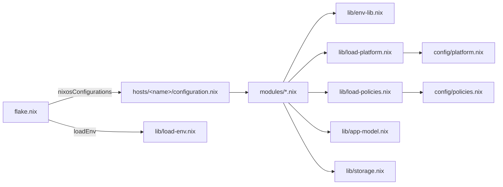

# NixOS modules reference

Per-file reference for every NixOS module under `modules/`: what it configures, which `lib/` helpers it imports, and which systemd units or containers it creates. For the concepts behind the platform see [platform.md](platform.md) and [architecture.md](architecture.md); for `.env` keys see [configuration.md](configuration.md).

> **Type:** reference · **Audience:** developer · **Last reviewed:** 2026-06-11

## Import chain

[flake.nix](../flake.nix) parses the per-host `.env` with [load-env.nix](../lib/load-env.nix) and passes the result as the `env` special arg; modules read it through [env-lib.nix](../lib/env-lib.nix) typed getters. Platform-aware modules re-merge the shared config with the host overlay via [load-platform.nix](../lib/load-platform.nix) / [load-policies.nix](../lib/load-policies.nix), so every module sees the same effective per-host config.

## Module summary

| Module | Purpose | lib/ imports | Units / containers created |
|---|---|---|---|
| [alerting.nix](../modules/alerting.nix) | Webhook alert on unit failure | — | `alert@.service` template, `alert-disk-watch` timer |
| [apps.nix](../modules/apps.nix) | Builds declared apps into services | env-lib, load-platform, app-model, storage | one `app-<name>.service` per app |
| [auth.nix](../modules/auth.nix) | oauth2-proxy front + tailnet HTTPS | env-lib | `oauth2-proxy`, `tailscale-serve` services |
| [backup.nix](../modules/backup.nix) | Restic backups per app volume | load-platform, load-policies, app-model, storage | per-app backup services + timers, verify/restore-test units |
| [control-api.nix](../modules/control-api.nix) | Go control plane + UI | env-lib | `control-api`, `hl-deploy@`, `hl-backup@`, `docker-socket-proxy` container |
| [docker.nix](../modules/docker.nix) | Docker daemon + hygiene | — | docker daemon (auto-prune timer) |
| [networking.nix](../modules/networking.nix) | Interface, firewall, container isolation | env-lib | — |
| [observability.nix](../modules/observability.nix) | Opt-in node_exporter + Prometheus | env-lib, load-platform | `prometheus`, `prometheus-node-exporter` |
| [platform.nix](../modules/platform.nix) | Validates + publishes platform manifests | load-platform, load-policies | — (writes `/etc/homelab/*.json`) |
| [secrets.nix](../modules/secrets.nix) | sops-nix secret declarations | — | — (materializes `/run/secrets/*`) |
| [ssh.nix](../modules/ssh.nix) | Hardened OpenSSH + fail2ban | env-lib | `sshd`, `fail2ban` |
| [tailscale.nix](../modules/tailscale.nix) | Tailnet membership | env-lib | `tailscaled` (ordering tweaks) |

## alerting.nix

[modules/alerting.nix](../modules/alerting.nix) defines an `alert@.service` template instantiated via `onFailure = [ "alert@%n.service" ]` (attached here and in `apps.nix` / `backup.nix`). On failure it POSTs hostname, unit name, timestamp and the last journal lines to a webhook whose URL is read **at runtime** from the sops secret file under `/run/secrets/` — if the secret is absent the script logs and exits 0, so the module is zero-config and has no eval-time dependency on the secret. ntfy-style URLs get a plain body with a Title header; anything else gets JSON. An `alert-disk-watch` timer additionally watches disk usage. Delivery is best-effort: a failed POST never fails anything else.

## apps.nix

[modules/apps.nix](../modules/apps.nix) is the core app deployment module. It discovers every `apps/*.nix` (skipping `default.nix` and `_templates/`), normalizes each definition through [app-model.nix](../lib/app-model.nix), resolves declared volumes to host paths with [storage.nix](../lib/storage.nix), and generates one `app-<name>.service` per app. Five runners are supported: `image`, `process`, `compose`, `dockerfile` and `nixos`. App `dependencies` become systemd `after`/`wants` on `app-<dep>.service`. Uses the per-host merged platform (via [load-platform.nix](../lib/load-platform.nix)) so host overlays flow into volume resolution. See [reference-nix-lib.md](reference-nix-lib.md) for the app schema.

## auth.nix

[modules/auth.nix](../modules/auth.nix) runs oauth2-proxy (GitHub OIDC) as the only identity front: it alone injects `X-Forwarded-Email`/`X-Forwarded-User`, and control-api listens on loopback so spoofed headers cannot reach it. A `tailscale-serve` service exposes oauth2-proxy on the tailnet over HTTPS; nothing is published on a raw public IP. The build **fails** unless at least one GitHub restriction (`OAUTH2_GITHUB_ORG` and/or `OAUTH2_GITHUB_USERS` in `.env`) is set, so authentication can never be left open to any GitHub account.

## backup.nix

[modules/backup.nix](../modules/backup.nix) generates one restic backup service + timer per app that declares a backed-up volume (per the storage class's `backedUp` flag), plus periodic verify (`restic check`) and restore-test units for criticality tiers that require them per [policies.nix](../config/policies.nix). Inert by default: until `platform.backup.repository` is set, importing it changes nothing. The restore semantics are proven end-to-end by [tests/restore-e2e.nix](../tests/restore-e2e.nix) — see [backups.md](backups.md).

## control-api.nix

[modules/control-api.nix](../modules/control-api.nix) builds the Go control-api and the web UI from the repo and runs them as a sandboxed `control-api` service (dedicated `controlapi` user, `NoNewPrivileges`, empty bounding set, **no sudo, no docker group**). Privileged actions go through D-Bus to systemd, authorized by a polkit rule, against fixed units only:

| Action | Mechanism |
|---|---|
| Deploy / backup jobs | `hl-deploy@`/`hl-backup@` template units with Nix-fixed `ExecStart` |
| App control | start/stop/restart of `app-*.service` only |
| Container ops | read/start/stop-only `docker-socket-proxy` OCI container over TCP, never the raw socket |
| Host ops | `systemctl reboot`, `systemctl restart docker.service` |

The binary is stamped with the deployed flake commit (`shortRev`, falling back to `dirtyShortRev`). A world-readable `homelab-source` copy of `config/`, `apps/`, `.sops.yaml` and secret ciphertexts lets the sandboxed API display source and rotation age without reading the operator's home checkout. Role mapping comes from [config/access.json](../config/access.json). API surface: [api.md](api.md).

## docker.nix

[modules/docker.nix](../modules/docker.nix) enables the Docker daemon (pinned package) with weekly auto-prune of images/containers/networks older than a week — never volumes, where app data may live — and json-file log rotation (10 MB × 3 files). Installs `docker-compose`.

## networking.nix

[modules/networking.nix](../modules/networking.nix) configures the network from `.env` via [env-lib.nix](../lib/env-lib.nix): interface, DHCP vs static IP/prefix/gateway, SSH port, and whether SSH is open on the public firewall (off by default — tailnet access is the norm). It also defines the module option `homelab.network.isolateContainers` controlling container network isolation.

## observability.nix

[modules/observability.nix](../modules/observability.nix) is opt-in (off by default): only when [config/platform.nix](../config/platform.nix) (or a `hosts/<name>/platform.nix` overlay) sets `observability.enable = true` does it run a node_exporter and a Prometheus scraping node metrics plus control-api's `/metrics`. Both bind loopback by default and are reached over the tailnet through the existing auth front; the module never opens a firewall port by itself. `extraTargets` lets a fleet Prometheus scrape other hosts' exporters. The enabled path is evaluated in CI through the `obstest` host (see [reference-nix-hosts.md](reference-nix-hosts.md)) and documented in [observability.md](observability.md).

## platform.nix

[modules/platform.nix](../modules/platform.nix) loads [config/platform.nix](../config/platform.nix), [config/policies.nix](../config/policies.nix) and [config/catalogs.nix](../config/catalogs.nix), validates them with eval-time assertions (storage class shapes, catalog schema, no moving refs), and publishes them read-only as `/etc/homelab/{platform,policies,catalogs}.json` for control-api and the CI validator. It deliberately applies no host identity itself — timezone/locale come from `.env` — so importing it only adds the manifests.

## secrets.nix

[modules/secrets.nix](../modules/secrets.nix) wires sops-nix: it enumerates the cleartext top-level keys of `secrets/homelab.yaml` and every `secrets/apps/*.yaml` at eval time (sops encrypts values but not mapping keys) and auto-declares one `sops.secrets.<key>` entry per key, so adding a secret to a yaml file is enough to materialize it under `/run/secrets/` at activation. See [security.md](security.md).

## ssh.nix

[modules/ssh.nix](../modules/ssh.nix) hardens OpenSSH: no root login, key-only auth by default (`SSH_PASSWORD_AUTH` toggle), no keyboard-interactive, limited auth tries, port from `SSH_PORT`. Enables fail2ban.

## tailscale.nix

[modules/tailscale.nix](../modules/tailscale.nix) enables Tailscale with `--ssh`, taking the auth key from the sops secret when declared and falling back to a file path from `.env`. It orders `tailscaled` after network-online to avoid races at boot.
