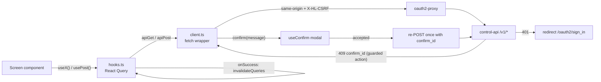

# Web UI: application shell and API layer

Reference for the cockpit's foundation: boot sequence, application shell (navigation, role gating, status chips), the shared component library, and the API layer (fetch wrapper plus React Query hooks) that connects every screen to the control-api. UI strings are French; this documentation is English.

> **Type:** reference · **Audience:** developer · **Last reviewed:** 2026-06-11

For the endpoint contracts behind these hooks see [api.md](api.md); for visuals of each screen see [screenshots.md](screenshots.md); for per-screen behavior see [reference-web-screens.md](reference-web-screens.md).

## Boot — [main.tsx](../web/src/main.tsx)

The entry point mounts `<App />` under `React.StrictMode` and a `QueryClientProvider`. The shared `QueryClient` is configured with `retry: 1` and `refetchOnWindowFocus: false` — polling is driven explicitly per hook via `refetchInterval`, not by focus events. Global styles come from a single [styles.css](../web/src/styles.css).

## Application shell — [App.tsx](../web/src/App.tsx)

### Routing and role gating

Routing is hash-based (`#/apps`, `#/system`, …) with no router library: `currentRoute()` parses `window.location.hash` against a static `SCREENS` registry, and a `hashchange` listener updates state. Unknown hashes fall back to `overview`.

Each screen entry may declare a `minRole`. Roles rank `viewer < operator < maintainer < admin`; an unknown role falls back to `viewer` (most restrictive). Gated screens are hidden from the nav and an active-but-forbidden route falls back to Overview. This is UX only — every action is also enforced server-side.

| Screen key | Label (FR) | Min role | Nav group |
|---|---|---|---|
| `overview` | Vue d'ensemble | — | Pilotage |
| `apps` | Apps | — | Applications |
| `library` | Bibliothèque | — | Applications |
| `changes` | Changements | — | Applications |
| `storage` | Stockage | — | Infrastructure |
| `secrets` | Secrets | maintainer | Infrastructure |
| `backups` | Sauvegardes | — | Infrastructure |
| `security` | Sécurité | — | Opérations |
| `monitoring` | Supervision | — | Opérations |
| `audit` | Audit | operator | Opérations |
| `system` | Système | — | Opérations |
| `settings` | Réglages | admin | Plateforme |

### Topbar status chips

| Chip | Hook | Behavior |
|---|---|---|
| `GlobalStatus` | `useSystem` | One-glance health pill: red when disk > 90%, orange when disk > 80% or the deployed commit is behind `main`, green otherwise. |
| `HostChip` | `usePlatform` | Shows the hostname from the platform manifest. The control-api is single-host, so this labels the driven machine — it is not a host selector. |
| `DriftChip` | `useDrift` | Hidden when up to date; orange "behind main" with deployed/main commit prefixes in the tooltip; grey "unknown" when the server's `ls-remote` has been failing too long (`stale`). |

### ErrorBoundary

A class component wraps the active screen so a render-time crash in one screen shows an inline error message instead of blanking the whole app. Its `resetKey` is the active route: navigating to another screen clears the error automatically.

## Shared component library — [components.tsx](../web/src/components.tsx)

| Export | Kind | Role |
|---|---|---|
| `Icon` | component | Inline SVG icon from a lean stroke set (~35 named paths); unknown names fall back to `info`. |
| `StateBadge` | component | Canonical state pill: `desired`, `runtime-ok`, `runtime-bad`, `action`, `risk`, `err`, `info`. |
| `ActionButton` | component | Action button that encodes the PR (durable, "Proposer (PR):") vs runtime ("Exécuter:") distinction in its tooltip prefix and default icon. |
| `Loading` | component | Renders a loading or error line from any React Query result; returns `null` once data is in. |
| `pct` | function | Formats a value as a rounded percentage, `–` when not a number. |
| `MetricCard` | component | KPI card with optional icon, tone, gauge bar, and click handler (used for cross-screen navigation). |
| `AlertBanner` | component | Prominent banner with tone-matched icon (`bad`/`warn`/`ok`/`info`). |
| `EmptyState` | component | Centered empty-state block with icon, title, text, and optional action. |
| `SectionHead` | component | Section heading with optional count, subtitle, and right-aligned action. |
| `Tabs` | component | Simple controlled tab strip. |
| `ActionMenu` | component | "⋯" menu rendered in a body-level portal with fixed positioning so it is never clipped by `overflow: hidden` table wrappers; closes on outside click, Escape, scroll, or resize. |
| `useMsg` | hook | Toast-ish inline message (`{text, ok}`) returning a setter plus a render node. |
| `useConfirm` | hook | In-app confirm modal returning a promise of `{ok, reason}` with optional danger styling and reason input. Replaces `window.confirm`/`prompt`, which silently return `false` once Chrome's "prevent additional dialogs" is ticked. |
| `Dialog` | component | Modal with backdrop click and Escape to close, focus on open, and a standard footer with a "Fermer" button. |

## Fetch wrapper — [client.ts](../web/src/api/client.ts)

Authentication is handled upstream by oauth2-proxy; the client sends `credentials: "same-origin"` and never holds tokens.

| Export | Role |
|---|---|
| `ApiError` | Error subclass carrying `status` and parsed `body`. Network failures are wrapped as `ApiError(0)` so callers always get a consistent shape. |
| `apiGet` | GET with `Accept: application/json` and the `X-HL-CSRF: 1` header (required by the control-api even for role-gated reads). On 401, redirects to `/oauth2/sign_in` with a return URL. |
| `apiPost` | JSON POST with the same CSRF header and 401 handling. |
| `apiPostConfirm` | Wraps `apiPost` with the server-side double-confirm flow for guarded actions (see below). |

### Double-confirm flow for guarded actions

The control-api guards risky actions (deploy switch, OS rollback, reboot, data purge) with a server-side challenge: the first POST returns HTTP 409 with `{ confirm: "double", confirm_id, message }`. `apiPostConfirm` surfaces `message` to a caller-supplied confirmer (sync or async — screens pass the `useConfirm` modal), and on acceptance re-POSTs the same payload exactly once with `confirm_id` merged in. A second armed response is not retried; it surfaces as an `ApiError`, so the client can never loop.

## React Query hooks — [hooks.ts](../web/src/api/hooks.ts)

All read hooks are thin `useQuery` wrappers over `apiGet`. Polling intervals: system 5s, apps-state/health 8s, observability 6s, backups/changes 10s, audit 15s, drift/updates 60s; the rest fetch on mount only.

| Hook | Endpoint | Used by |
|---|---|---|
| `useMe` | `/v1/me` | App shell (role + identity) |
| `useSystem` | `/v1/system` | App shell (`GlobalStatus`), Overview, System |
| `useAppsState` | `/v1/apps/state` | Overview, Apps, Security |
| `usePolicies` | `/v1/policies` | Overview, Security |
| `useStorage` | `/v1/storage` | Storage |
| `useSecrets` | `/v1/secrets/status` | Overview, Secrets |
| `useBackups` | `/v1/backups` | Overview, Backups |
| `useHealth` | `/v1/health/apps` | (currently unused by screens) |
| `useObservability` | `/v1/observability` | Monitoring |
| `useLibrary` | `/v1/library` | Library, Settings (catalogs tab) |
| `useChanges` | `/v1/changes` | Overview, Changes |
| `usePlatform` | `/v1/platform` | App shell (`HostChip`), System |
| `useDrift` | `/v1/drift` | App shell (`DriftChip`) |
| `useUpdates` | `/v1/updates` | Apps |
| `useGenerations` | `/v1/generations` | System (rollback dialog) |
| `useSystemSecrets` | `/v1/secrets/system` | Secrets |
| `useStorageOrphans` | `/v1/storage/orphans` | Storage |
| `useAudit` | `/v1/audit?…` (limit/op/result/include_ui filters) | Audit |
| `usePost` | any POST path | Apps, Library, Backups, Secrets, Storage, AddAppDialog — mutation that invalidates listed query keys on success |
| `usePostConfirm` | any guarded POST path | System, Storage — same, but routes through `apiPostConfirm` |

Screens also call `apiGet`/`apiPost` directly for one-shot fetches that don't need caching (logs, diffs, config-file contents, previews).

## Data flow

