# Screenshots

Full-screen captures of every screen of the HomeLab control panel (UI shown in French), taken live against a deployed instance.

> **Type:** reference · **Audience:** operator · **Last reviewed:** 2026-06-11

## Pilotage

### Vue d'ensemble
Global health verdict, system resources, platform state and recent GitOps changes.

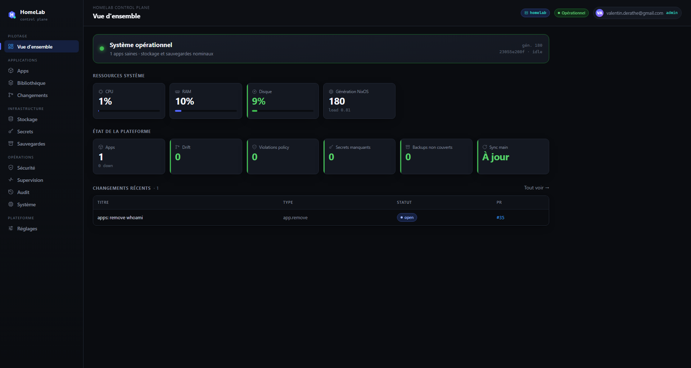

## Applications

### Apps
Managed applications: runtime state, drift, secrets, backup and policy status, with per-app actions (open, logs, restart, healthcheck, policy edit, rollback, remove).

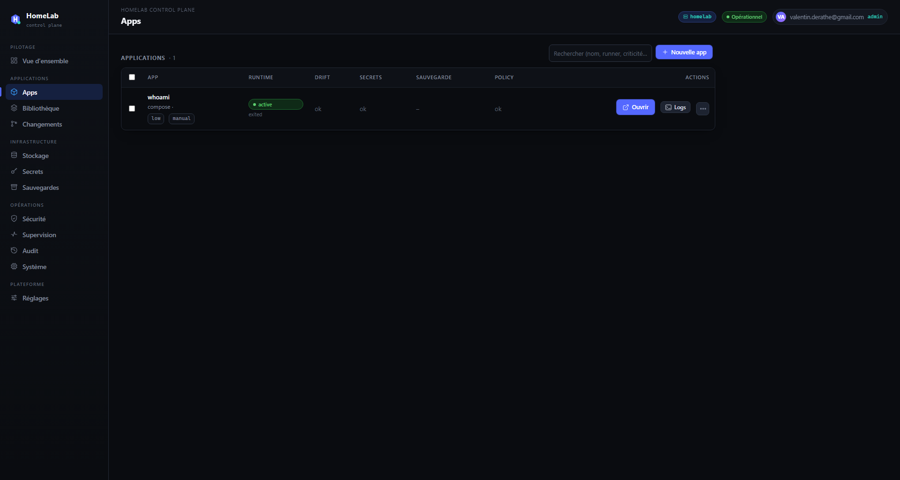

### Bibliothèque
Workshop catalogs and installed modules.

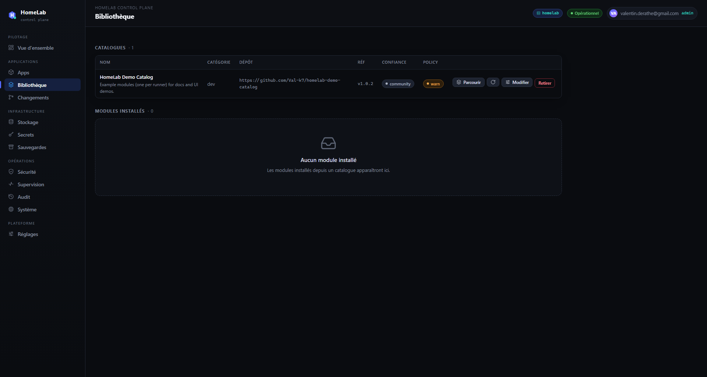

### Changements
GitOps pipeline: every change proposed from the panel as a pull request, with CI / review / PR status.

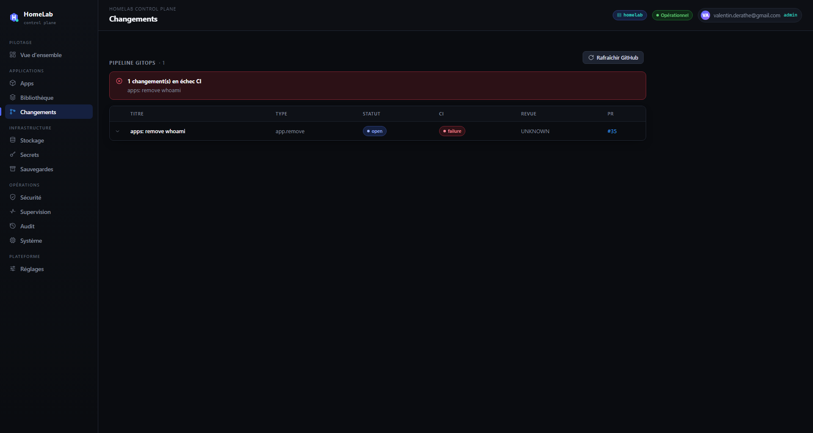

### GitOps — liste des changements
List view of every change record, with branch, PR and CI status.

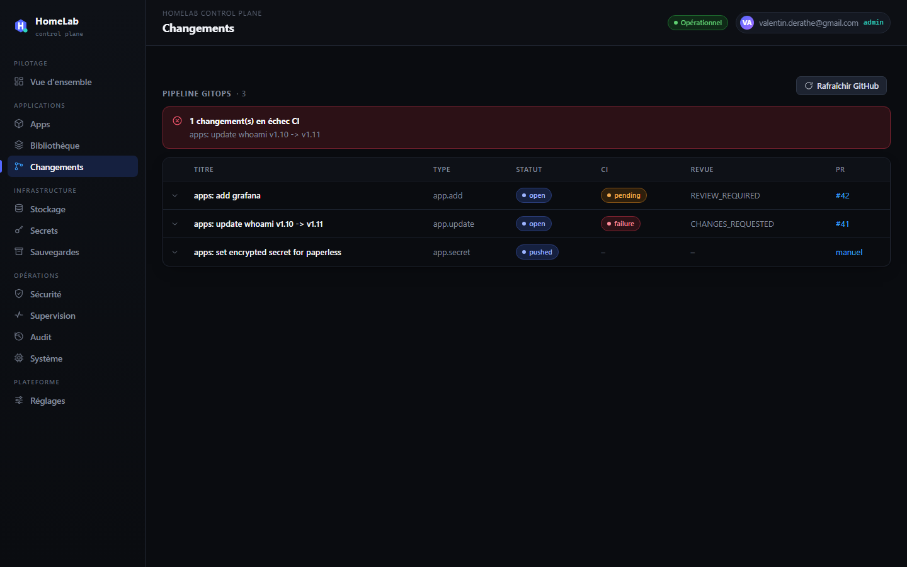

### GitOps — détail (ouvert)
Opened change detail: diff, metadata and available actions.

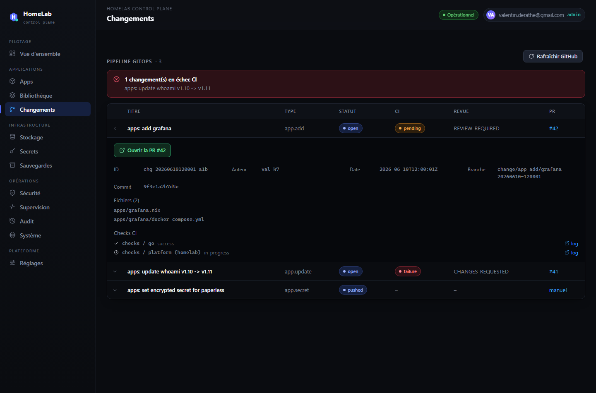

### GitOps — détail (poussé)
Change pushed to its branch with the pull request created (PR state visible).

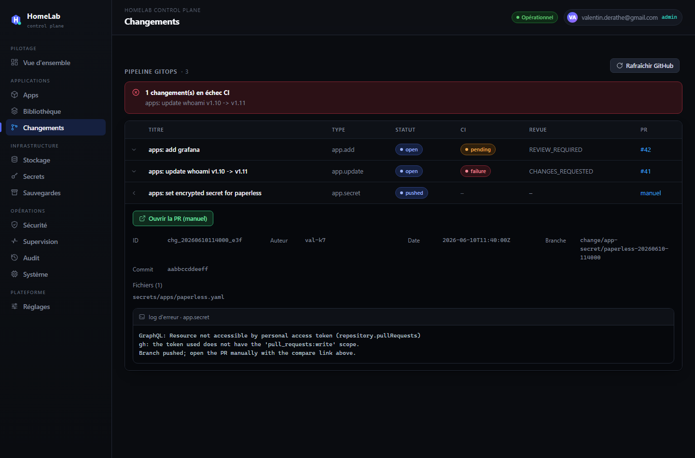

## Infrastructure

### Stockage
Storage classes (type, base path, backup and persistence flags) and declared volumes.

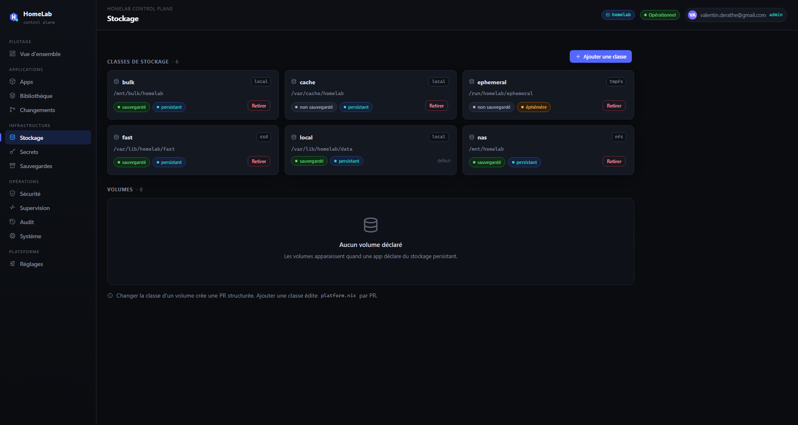

### Secrets
Per-app secret status — values are never read nor displayed; set/rotate goes through SOPS-encrypted pull requests.

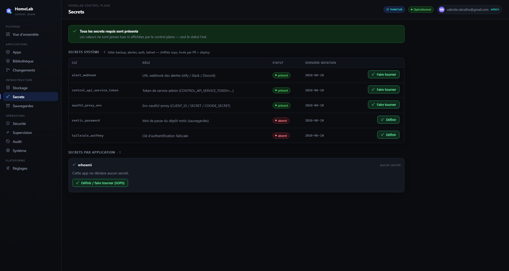

### Sauvegardes
Backup coverage, per-app detail and runtime actions (backup, restore test, verify, snapshots, restore).

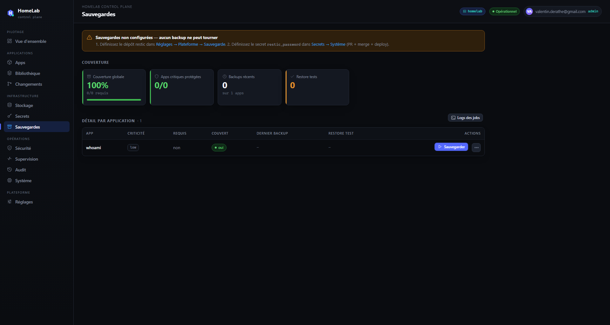

## Opérations

### Sécurité
Per-app permissions, policy violations and the global policy set.

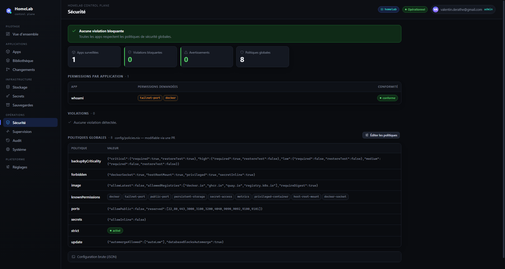

### Supervision
Internal observability: host roll-up, project infrastructure health and per-app runtime (CPU, RAM, restarts, uptime, logs).

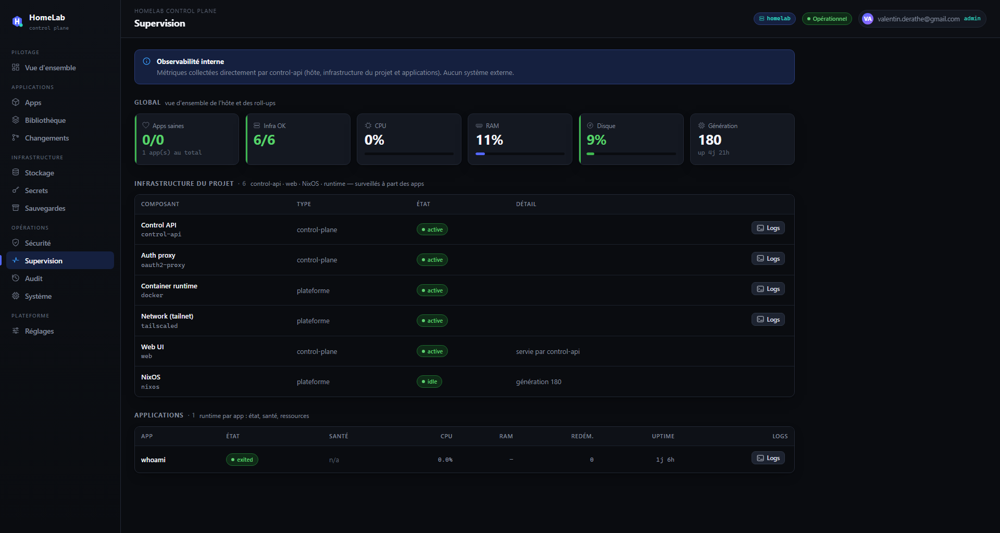

### Audit
Audit journal of every control-plane action, with server-side filters.

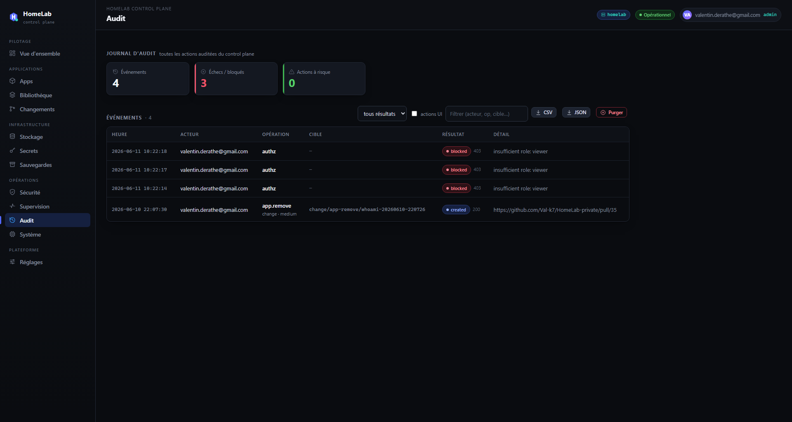

### Système
Host resources, deployed commit vs main, infra services, platform manifest and the sensitive actions zone (deploy, generation rollback, host reboot).

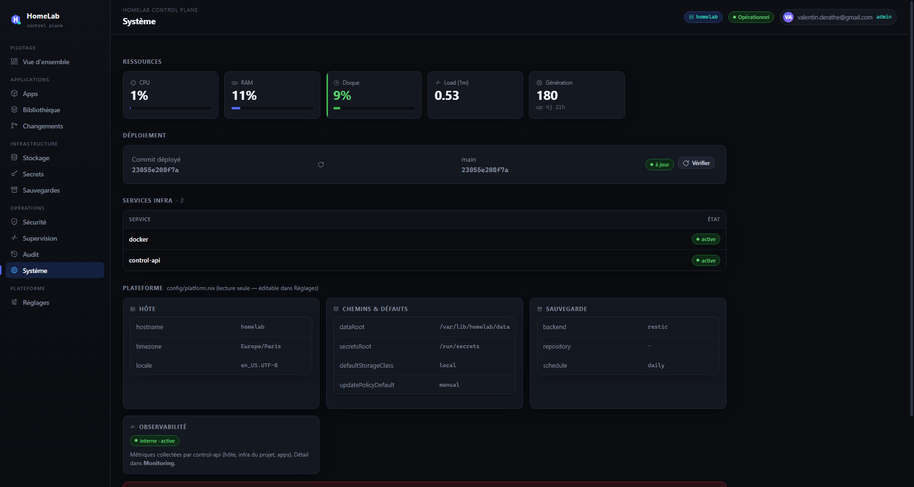

## Plateforme

### Réglages
Access & roles, platform configuration editors (backup, platform.nix, policies.nix) and workshop catalogs — every change opens a pull request.

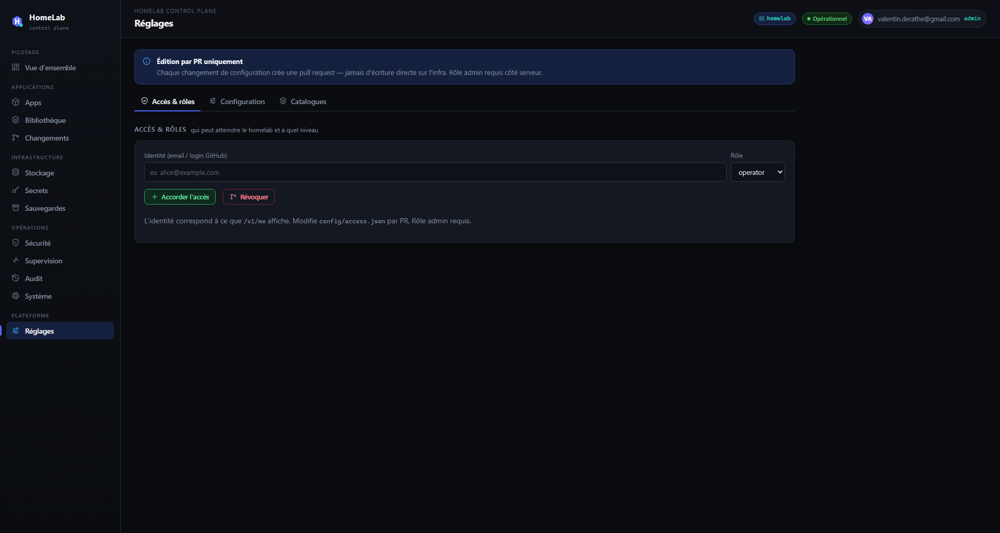
